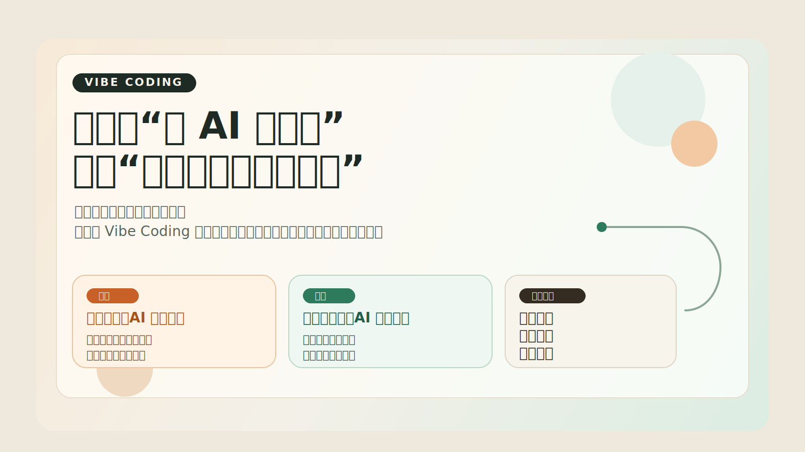
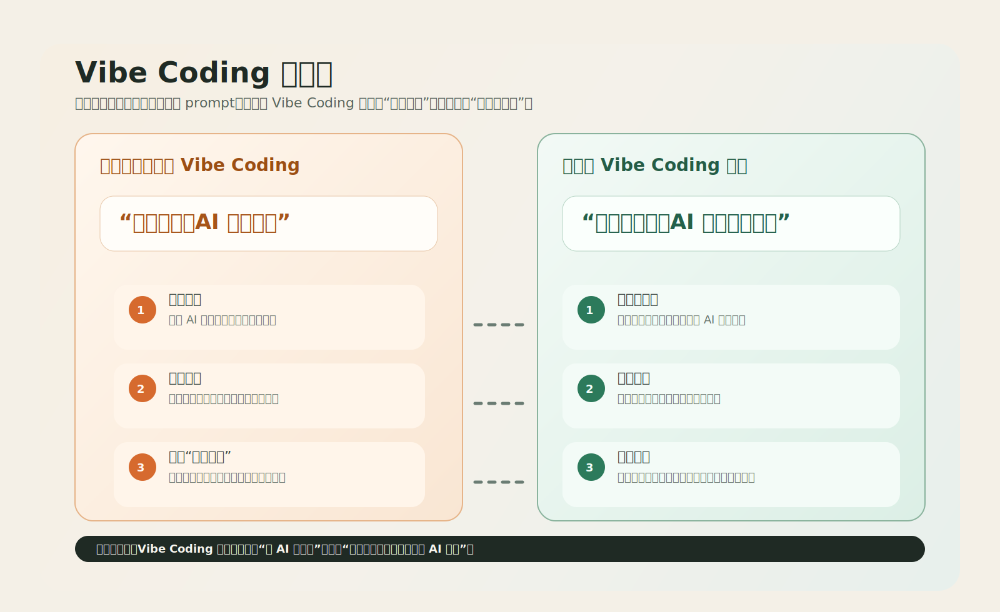

# Vibe Coding 到底是什么：为什么它很火，但很多人一开始就用错了

## 标题备选

- Vibe Coding 到底是什么：为什么它很火，但很多人一开始就用错了
- 大多数人都误解了 Vibe Coding：真正该学的不是 prompt，而是工作方式
- 从 AI 帮你写代码，到你开始管理 AI：这才是 Vibe Coding 的本质

## 导语版开头

如果你最近开始用 AI 写代码，你大概率已经感受过那种很强的“上头感”。

一句话给出需求，AI 就能帮你搭页面、补逻辑、改样式、修 bug。很多人第一次会觉得，写软件这件事好像突然没那么难了。

但也正因为第一步太顺，很多人会很快掉进同一个坑：  
他们以为 Vibe Coding 的重点是“让 AI 帮我写”，结果越用越乱，越用越累，最后开始怀疑是不是自己 prompt 不够强。

我越来越觉得，Vibe Coding 最容易被误解的地方也正在这里。  
它当然和“让 AI 参与写代码”有关，但如果只停留在这一层，你很快就会遇到天花板。

真正值得理解的，不是 AI 到底替你省了多少敲代码的时间，而是：  
**它正在改变你和软件开发之间的分工方式。**

## 开篇摘要

如果你最近刚开始接触 AI 编程，大概率已经体验过一种很上头的感觉：  
你只要把想法说出来，AI 就能帮你搭页面、改功能、修 Bug，甚至把一个看起来很像样的 Demo 很快做出来。

也正因为这种体验太强了，很多人会很自然地把 Vibe Coding 理解成一句话：

**“我负责提需求，AI 负责写代码。”**

这个理解不能说完全错，但它只抓住了表面。真正决定你后面能不能持续用好 AI 的，不是你会不会写几句 prompt，而是你有没有开始建立一种新的工作方式。

这篇文章主要想回答三个问题：

- Vibe Coding 到底是什么，不是什么
- 为什么很多人第一周就会走偏
- 对初学者来说，最该先补的到底是什么

## 一、为什么 Vibe Coding 这么容易让人上头

Vibe Coding 火起来，不是因为它带来了一点点效率提升，而是因为它第一次让很多人真实感受到：

**“我不需要先把所有代码都自己写出来，事情也能开始推进。”**

过去做一个功能，很多人的路径是这样的：

1. 先想清楚方案
2. 查文档
3. 写代码
4. 运行报错
5. 继续修
6. 补细节

而在 AI 编程工具介入之后，路径开始变成：

1. 先把目标说出来
2. 让 AI 给出第一版
3. 一边看，一边改，一边往前推进

对初学者来说，这种变化非常大。它带来的不是“少打几行字”这么简单，而是一种门槛感的变化。

比如以前你可能觉得：

- “我不会 React，所以这个页面我做不了”
- “我不熟后端接口，所以这个功能我做不了”
- “我不太会调样式，所以这件事我做不了”

而现在你开始觉得：

- “也许我可以先让 AI 帮我起一个版本”
- “也许我可以先做出来，再慢慢改”

这种感觉很重要。因为它让很多人第一次真正开始动手。

但问题也恰恰出在这里。  
很多人一旦第一次体验很顺，就会迅速高估自己已经掌握了这套方法。

## 二、Vibe Coding 到底是什么

如果要我用一句话定义，我会这样说：

**Vibe Coding 不是把编程完全交给 AI，而是把你的工作重心，从“亲手写出每一行代码”逐步转向“描述问题、判断结果、管理过程”。**

这个定义里有三个关键词特别重要：

- 描述问题
- 判断结果
- 管理过程

### 1. 描述问题

过去你在软件开发里最重要的表达方式，往往是代码本身。  
现在越来越多时候，你的第一层表达方式变成了自然语言。

你要先说清楚：

- 你想做什么
- 你要解决什么问题
- 你期待的结果是什么
- 你不想要什么

这不是“会聊天”这么简单，而是一种更高层的表达能力。

### 2. 判断结果

AI 可以给你第一版，但它不会自动替你承担判断。

你依然要能看出来：

- 这个结果是不是偏了
- 它只是表面能跑，还是结构也合理
- 哪些地方只是看起来对
- 哪些地方以后会越来越难改

这也是为什么真正把 AI 用得顺的人，往往不是最会炫 prompt 的人，而是最会判断结果的人。

### 3. 管理过程

这是最容易被忽略，但其实最关键的一层。

真正的 Vibe Coding，不是“我扔一句话，AI 回一段代码”就结束了，而是你要开始管理一整条过程：

- 现在该先做什么
- 边界要不要先定清楚
- 什么时候该继续放手给 AI
- 什么时候该停下来检查
- 什么时候该把经验沉淀成规则

所以如果只说本质，我会认为：

**Vibe Coding 不是一种偷懒技巧，而是一种新的软件工作方式。**

## 三、Vibe Coding 不是什么

把概念讲清楚，最好的方式之一就是顺手把几个常见误解拆掉。

### 1. 它不是“完全不用懂”

这是最常见、也最危险的误解。

很多人会把 Vibe Coding 想象成一种终极解放：

“我不用懂技术了，只要会说，AI 就能把产品做完。”

这类想法很容易让人兴奋，但它不稳。

因为 AI 可以帮你生成很多内容，却不能自动替你承担责任。你还是要知道：

- 现在真正的问题是什么
- 这个方案是不是在绕远路
- 这段代码有没有把风险藏起来
- 这个页面是不是只做到了“看起来能用”

换句话说，Vibe Coding 不是不理解，而是**理解的重点变了**。

### 2. 它不是“写一个万能 prompt”

很多初学者会很自然地把问题归结成：

“是不是我 prompt 写得不够好？”

这当然有一部分关系，但通常不是最核心的。

真正决定效果的，往往不是你写没写出一句“神 prompt”，而是你有没有一条稳定流程。

如果没有流程，你很容易陷入这种循环：

- 先让 AI 快速生成
- 发现不对，再补一句
- 又偏了，再补一句
- 最后上下文越来越乱，结果越改越散

这不是你不会提问，而是你还在把 AI 当成一次性回答机器，而不是一个需要被管理的协作对象。

### 3. 它不是“功能越多越高级”

很多人一开始学习 AI 编程时，特别容易掉进功能崇拜。

例如：

- 这个工具能不能自动改 20 个文件
- 那个工具支不支持 agent
- 这个产品能不能联网
- 那个平台能不能自动调试

这些功能当然重要，但对于初学者来说，它们通常不是第一优先级。

因为在你还没形成最小工作闭环之前，功能越多，反而越容易把你带乱。

对初学者来说，更重要的问题不是“哪个最强”，而是：

**我能不能先把一件真实的小事稳定做完。**

## 四、为什么很多人第一周就走偏了

如果你观察一下刚开始接触 Vibe Coding 的用户，会发现他们常常不是卡在“不会开始”，而是卡在“开始得太顺，后面就乱了”。

我觉得最常见的原因有三个。

### 第一，太容易高估第一次成功

第一次让 AI 帮你做出一个页面、补出一个功能、修掉一个小问题时，冲击感会非常强。

这会让人产生一个很自然的错觉：

**“既然这次这么顺，那以后应该也差不多。”**

但第一次顺，往往只是因为：

- 任务还很小
- 上下文还很短
- 依赖关系还不复杂
- 你还没进入持续迭代阶段

真正的问题常常出现在第二阶段：

- 改动开始叠加
- 需求开始变化
- 文件之间开始互相影响
- 原本看起来没问题的部分开始互相打架

所以你必须尽早意识到：

**第一次高光，不代表你已经掌握了 Vibe Coding。**

### 第二，学的是功能，不是路径

很多人花很多时间研究工具清单、功能对比、模型差异，但真正上手时还是很乱。

原因不是这些内容没用，而是它们离“今天就能跑通一个闭环”还差了一层。

初学者最需要的，不是工具海，而是一条最小路径：

1. 先定义一个真实任务
2. 让 AI 给出第一版
3. 自己检查结果
4. 继续修正
5. 最后完成一次可复盘的小交付

只要这个闭环没跑通，知道再多功能，也很难真正转化成稳定能力。

### 第三，没有意识到“管理过程”才是核心能力

在传统编程认知里，很多人会把“能力强”理解成：

- 写得快
- 记得多
- API 熟
- 调 Bug 厉害

这些能力当然仍然重要。  
但在 AI 参与之后，另外一类能力会迅速上升：

**你能不能管理这个过程。**

比如：

- 你能不能把任务边界说清楚
- 你能不能知道什么时候该继续放手，什么时候该收回来
- 你能不能把一次偶然成功，变成下次还能复用的规则
- 你能不能把混乱过程收束成更稳定的方法

这也是为什么一些看起来“技术不一定最强”的人，反而更容易把 AI 用顺。因为他们更擅长组织过程，而不仅仅是写实现。

## 五、用一个具体例子看，初学者到底错在哪

如果只讲概念，很多人会觉得还是有点虚。  
我们直接看一个很典型的初学者场景。

### 场景：做一个报名页面

一个刚开始接触 AI 编程的用户，想做一个活动报名页面。

他可能会这样跟 AI 说：

> 帮我做一个活动报名页面，要好看一点，有姓名、手机号、公司、提交按钮。

AI 很快给出一个页面。  
用户一看，觉得不错，于是继续说：

> 再加一个成功提示。

然后又说：

> 再支持手机号校验。

再往后：

> 再接一个接口。

再往后：

> 再帮我把样式做得更高级一点。

看到这里你会发现，这种推进方式的问题不是“做不出来”，而是它从第一步开始就缺东西：

- 没有先定义页面目标
- 没有先定义提交后的流程
- 没有先说明数据校验规则
- 没有先判断这只是 Demo 还是要上线

于是前面每一步都看起来合理，但后面会越来越乱。

### 更稳的做法是什么

同样是这个需求，更稳的起手方式应该是：

> 我要做一个活动报名页，目标是让用户提交报名信息。  
> 先帮我给出一个最小可用版本，包括姓名、手机号、公司字段和提交按钮。  
> 暂时不接真实接口，先本地模拟提交成功。  
> 请先列出页面结构和交互流程，再开始写代码。

这时候你会发现，变化不只是 prompt 更长了，而是你开始在管理过程：

- 你先限定了目标
- 你先限定了范围
- 你先说明了当前阶段
- 你要求 AI 先给结构，再动手实现

这就是 Vibe Coding 真正有价值的地方。  
不是“你会不会一句话召唤神迹”，而是“你有没有开始像一个工作流设计者一样推进事情”。

## 六、初学者最该先学的，不是技巧，而是这三件事

如果你的用户现在也处在 Vibe Coding 的初始阶段，我更建议先把注意力放在下面三件事上。

### 1. 先别问“哪个工具最强”，先问“我现在缺什么”

刚开始最常见的误区，就是一头扎进工具海。

今天看 Codex，明天看 Claude Code，后天看 Cursor，再过两天又去研究 agent workflow、MCP、浏览器自动化、多 agent 协作。最后什么都看过一点，但没有一条线真正走通。

更好的问题是：

- 我现在缺的是认知，还是工具上手
- 我现在缺的是第一个真实任务，还是更稳定的工作流
- 我是需要“先做出来”，还是需要“先做稳”

只有先知道自己缺什么，工具选择才有意义。

### 2. 把目标从“学会 AI 编程”改成“跑通一个小闭环”

很多初学者一开始的目标都太大：

- 学会 AI 编程
- 学会 agent
- 提高效率

这些目标听起来都对，但太空。

更适合初学者的目标应该具体到：

- 用一个工具完成一个真实的小功能
- 用 AI 修一个真实 Bug
- 用 AI 帮我做一次页面改版
- 用 AI 帮我整理一次项目规则

目标一具体，学习就会立刻落地。

### 3. 从第一天开始培养“结果判断”能力

新手最容易把 AI 当成答案机器。  
但真正能长期走下去的人，会很早养成一个习惯：

**不只是问 AI 能不能做，而是问这个结果到底靠不靠谱。**

你可以从最简单的四个问题开始：

- 这个结果真的解决了我的问题吗
- 它只是表面能跑，还是结构也合理
- 哪些地方我还没验证
- 如果明天再改，它会不会立刻变乱

这类判断能力，看起来不像“技巧”，但它决定了你后面会不会越用越稳。

## 七、Vibe Coding 的边界在哪里

把一件事讲得更完整，除了说价值，也要把边界说清楚。

### 1. 它不等于完全不学习

AI 可以帮你大幅降低实现成本，但它不会让“理解问题、判断质量、管理过程”这些能力自动消失。

如果有人把 Vibe Coding 理解成“我什么都不用懂了”，那他大概率很快就会卡住。

### 2. 它不适合一上来就追求复杂自动化

对于初学者来说，一上来就讲多 agent、复杂编排、工具链自动连接，通常不是最优路径。

这些能力当然有价值，但它们更适合放在已经跑通基本闭环之后。

### 3. 它最难的地方，不在生成，而在收敛

AI 最擅长的是给你很多可能性。  
但真实工作里更难的，往往不是“有没有候选答案”，而是：

- 选哪个
- 为什么选这个
- 选完后怎么稳定往前走
- 怎样避免下一轮又重新混乱

所以 Vibe Coding 走到后面，一定会进入工作流、规则、边界、质量和安全这些话题。

## 八、如果你读完只记住一件事

如果这篇文章最后只留一句话，我希望是这句：

**Vibe Coding 不是“让 AI 替你写代码”这么简单，它真正改变的是你和软件开发之间的分工方式。**

它最吸引人的地方，在于它让更多人第一次觉得“我也能开始做点东西”。  
但它最容易让人误解的地方，也在于大家会以为：只要会说话，就已经掌握了这套方法。

真正决定你能不能从入门走向进阶的，不是你有没有学会几个更厉害的 prompt，而是你有没有开始理解下面这些事情：

- 我到底要解决什么问题
- 我怎样把问题说清楚
- 我怎样判断结果是不是对的
- 我怎样把一次成功变成可复用的方法

所以对初学者来说，最重要的第一步，不是追求更复杂的工具，不是追求更炫的 agent，也不是幻想 AI 会自动帮你做完一切。

更重要的第一步是：

**先建立一套正确认知。**

只有这样，后面工具上手、工作流设计、agent 协作、质量和安全这些进阶能力，才会真的长在地上。

## 适合传播的结尾金句

- Vibe Coding 最值得学的，不是“怎么让 AI 多写一点”，而是“怎么让自己少乱一点”。
- 真正的进阶，不是会写更厉害的 prompt，而是开始用工作流的方式和 AI 协作。
- AI 可以替你生成很多东西，但决定你能不能走远的，依然是你定义问题、判断结果和管理过程的能力。
- 从“让 AI 帮我写代码”到“我开始管理 AI 完成任务”，这中间的跨越，才是 Vibe Coding 真正的门槛。

## 九、读完后你可以立刻做的一个动作

如果你想让这篇文章不只是“看懂了”，而是真的开始转化成自己的方法，我建议你今天就做一个很小的动作：

挑一个你最近真正想完成的小任务，然后只做下面四步：

1. 先写下你到底要解决什么问题
2. 写下这次先不做什么
3. 让 AI 先给结构和步骤，再写实现
4. 写完后自己回答一句：这个结果只是能跑，还是已经靠谱

这四步很小，但它会帮助你从“随机试 AI”开始走向“有方法地和 AI 协作”。

而这，才是 Vibe Coding 真正值得学的地方。

## 参考来源

- [[2026-03-23_link_vibe-coders-guide]]
- [[2026-03-23_article_openai_practical-guide-building-ai-agents]]
