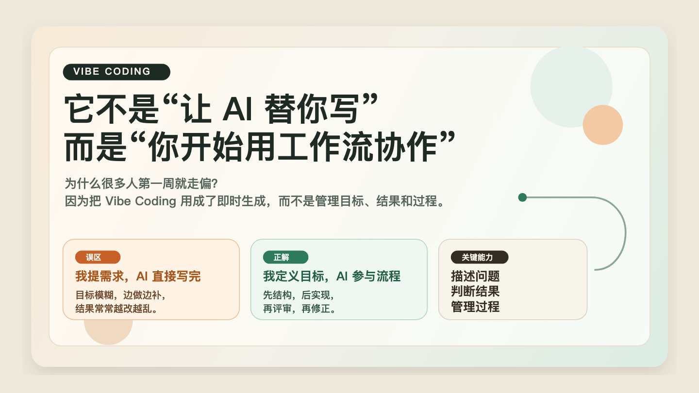
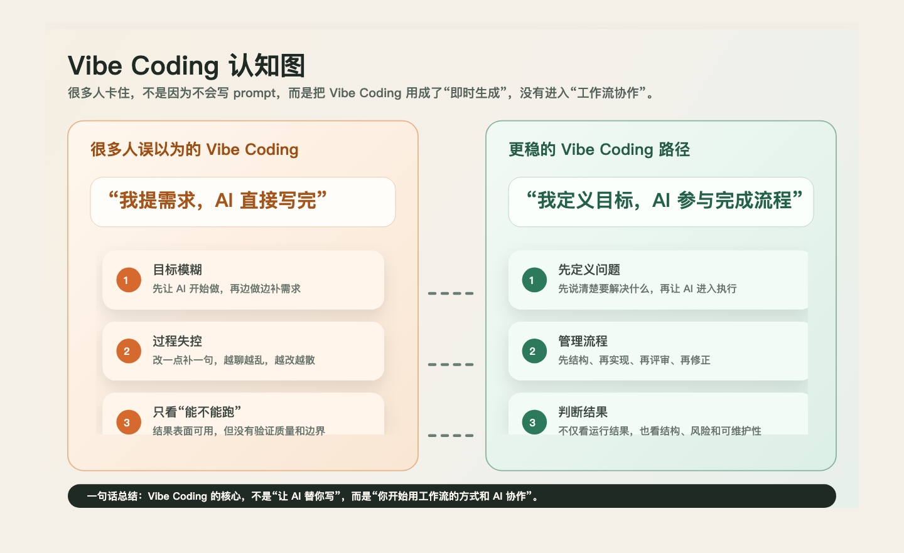
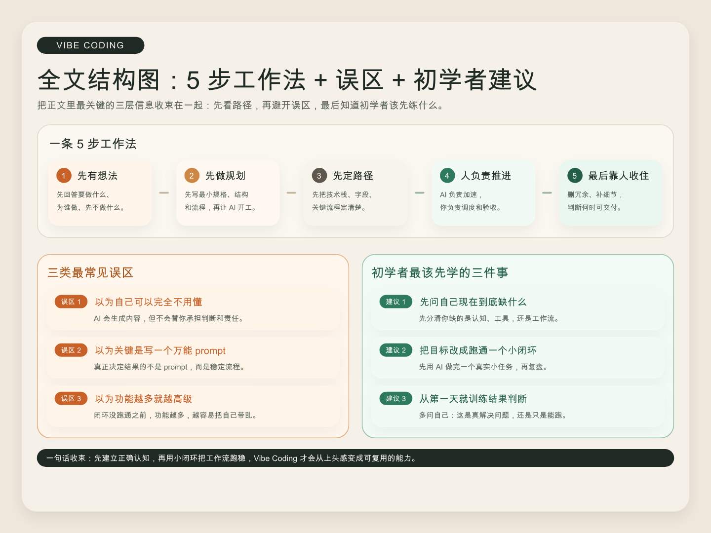

# 大多数人都误解了 Vibe Coding：真正该学的不是 prompt，而是工作方式



如果你刚开始用 AI 写代码、搭页面、做原型，你大概率已经体验过那种很强的“上头感”。

一句话给出需求，AI 就能帮你起页面、补逻辑、修样式、排查报错。很多人第一次会觉得，软件开发这件事突然没有以前那么难了。

但也正因为第一步太顺，很多人会很快掉进同一个坑：  
他们以为 Vibe Coding 的重点是“让 AI 多写一点代码”，结果越用越乱，越用越累，最后开始怀疑是不是自己 prompt 不够强。

我更想把这篇文章写给一类很具体的人：  
**刚开始用 AI 写代码、做页面、搭原型的人。**

如果你也处在这个阶段，那这篇文章最想回答的不是“哪个工具最强”，而是另外三个问题：

- 为什么 Vibe Coding 这么容易让人上头
- 它到底是什么，不是什么
- 新手怎么才能从“随机试 AI”走向“稳定做出东西”



## 一、为什么 Vibe Coding 这么容易让人上头

Vibe Coding 火起来，不只是因为“效率提高了一点”，而是因为它同时击中了四种很强的体验。

### 1. 门槛突然变低了

过去你想做一个页面、一个小功能，往往要先补很多前置知识：

- 这个框架怎么起项目
- 这个组件怎么写
- 这个接口怎么调
- 这个样式怎么改

而在 AI 编程工具介入之后，很多事情变成了：

1. 先把目标说出来
2. 让 AI 给出第一版
3. 一边看，一边改，一边继续推进

这会让很多人第一次真切感受到：

**“我不需要先把所有代码都自己写出来，事情也能开始推进。”**

### 2. 反馈突然变快了

传统学习编程时，你经常要先查资料、写代码、运行、报错、修复，走很长一圈，才知道自己是不是理解对了。

AI 把这个过程大幅压短了。

你刚有一个想法，很快就能看到第一版结果。  
这种“说一句话就有反馈”的体验，会极大放大行动冲动。

### 3. 成就感来得太早了

很多初学者第一次做出一个能点、能填、能提交的小页面时，会立刻产生一种很强的感觉：

**“原来我也可以做软件。”**

这种感觉非常重要，因为它真的能推动人开始动手。  
但它也很容易制造错觉，让人过早高估自己已经掌握了方法。

### 4. 试错成本看起来变低了

以前一个想法如果要自己从头实现，很多人会因为嫌麻烦而不敢开始。  
现在你会觉得：

- “先让 AI 试一版也没什么”
- “做错了再改就行”
- “反正生成很快”

这种低成本试错感，确实让创新更容易开始。  
但它也会让很多人忽略一件事：**生成很快，不等于收敛也很快。**

所以 Vibe Coding 真正让人上头的，不只是“AI 很强”，而是它第一次让很多人同时感受到：

- 我可以开始了
- 我可以很快看到结果
- 我可以很快拿到成就感
- 我好像随时都能改回来

也正因为这套体验太强，很多人会自然把 Vibe Coding 理解成一句话：

**“就是让 AI 帮我把代码写出来。”**

这恰恰是最容易走偏的起点。

## 二、Vibe Coding 到底是什么

如果要我用一句话定义，我会这样说：

**Vibe Coding 不是把编程完全交给 AI，而是把你的工作重心，从“亲手写出每一行代码”逐步转向“描述问题、判断结果、管理过程”。**

这个定义里最重要的，不是“AI 会不会写”，而是人的角色发生了变化。

### 1. 描述问题

你首先要说清楚：

- 你到底要做什么
- 这次先解决什么问题
- 你期待的结果是什么
- 哪些内容这次先不做

这不是“会聊天”这么简单，而是一种更高层的表达能力。

### 2. 判断结果

AI 可以很快给你第一版，但它不会自动替你承担判断。

你依然要能看出来：

- 这个结果是不是偏了
- 它只是表面能跑，还是结构也合理
- 哪些地方还没验证
- 如果继续改，它会不会越来越乱

所以真正把 AI 用得顺的人，通常不是最会炫 prompt 的人，而是最会判断结果的人。

### 3. 管理过程

这是最容易被忽略，但其实最关键的一层。

真正的 Vibe Coding 不是“我扔一句话，AI 回一段代码”就结束了，而是你要开始管理整条过程：

- 现在该先做什么
- 边界要不要先定清楚
- 什么时候该继续放手给 AI
- 什么时候该停下来检查
- 什么时候该把经验沉淀成规则

所以如果只说本质，我会认为：

**Vibe Coding 不是一种偷懒技巧，而是一种新的软件工作方式。**



## 三、新手最容易掉进的三个坑

如果你刚开始接触 AI 编程，最容易掉进去的通常不是技术坑，而是认知坑。

### 1. 以为“我可以完全不用懂”

这是最常见、也最危险的误解。

很多人会把 Vibe Coding 理解成一种终极解放：

“我不用懂技术了，只要会说，AI 就能把产品做完。”

这种想法很容易让人兴奋，但它不稳。因为 AI 可以替你生成内容，却不能替你承担责任。你还是要知道：

- 现在真正的问题是什么
- 这个方案是不是在绕远路
- 这段代码有没有把风险藏起来
- 这个页面是不是只做到了“看起来能用”

换句话说，Vibe Coding 不是不理解，而是**理解的重点变了**。

### 2. 以为“写一个万能 prompt 就够了”

很多初学者一旦遇到问题，会很自然地归因成一句话：

“是不是我 prompt 写得不够好？”

这当然会有影响，但通常不是最核心的问题。

真正决定结果的，往往不是你有没有一条“神 prompt”，而是你有没有一条稳定流程。

如果没有流程，你很容易陷入这种循环：

1. 先让 AI 快速生成
2. 发现不对，再补一句
3. 又偏了，再补一句
4. 最后上下文越来越乱，结果越改越散

这不是你不会提问，而是你还在把 AI 当成一次性回答机器，而不是一个需要被管理的协作对象。

### 3. 以为“功能越多就越高级”

很多人刚开始学 AI 编程时，特别容易掉进功能崇拜：

- 这个工具能不能自动改 20 个文件
- 那个平台支不支持 agent
- 这个产品能不能联网
- 那个工具能不能自动调试

这些功能当然重要，但对于初学者来说，它们通常不是第一优先级。

在你还没形成最小工作闭环之前，功能越多，反而越容易把你带乱。

对新手来说，更重要的问题不是“哪个最强”，而是：

**我能不能先把一件真实的小事稳定做完。**

## 四、Vibe Coding 真正可用的一条 5 步工作法

如果只讲“描述问题、判断结果、管理过程”，很多人会觉得方向对，但还不够能落地。

更容易执行的方式，是把它拆成一条 5 步工作法：

**想法 -> 规划 -> 路径 -> 推进 -> 打磨**

### 1. 想法：先把问题说清楚

第一步不是打开工具，而是先回答：

- 你到底要做什么
- 这件事为什么值得做
- 目标用户是谁
- 这次最小价值是什么

AI 降低了“写代码”的门槛，但没有降低“想清楚要做什么”的门槛。

### 2. 规划：先写最小规格，再让 AI 开工

很多人以为有了 AI 之后就可以少做规划。  
实际上恰恰相反，越是能快速生成，越需要先把蓝图定住。

哪怕只是一段很短的 Markdown，也至少要写出：

- 任务目标
- 页面或功能范围
- 交付标准
- 当前阶段不做什么

Vibe Coding 不是少做规划，而是更依赖规划。

### 3. 路径：先定栈和关键流程，再谈工具能力

很多体验不顺，不是因为模型不够强，而是因为路径没定清楚。

至少要先明确：

- 技术栈是否稳定
- 页面结构是否明确
- 数据字段是否想清楚
- 登录、提交、校验这些关键流程是否已定

稳定路径，通常比强大功能更重要。

### 4. 推进：人负责推进，AI 负责加速

真正开始做的时候，人的角色不是旁观者，而是调度者。

你需要持续做几件事：

- 给 AI 当前最明确的任务
- 检查这次改动有没有跑偏
- 判断现在该继续生成，还是先停下来验收
- 把有效做法沉淀成下一次可复用的规则

所以我最想保留的一句话是：

**AI 负责加速，但你负责推进。**

### 5. 打磨：最后靠人的判断把东西收住

很多 Demo 死在最后一步。

不是因为功能做不出来，而是做到后面开始出现这种状态：

- 页面能跑，但不顺
- 逻辑能用，但不稳
- 样式热闹，但没有质感
- 功能不少，但整体体验很散

这时候真正决定成色的，往往不是再多生成一点代码，而是人的判断：

- 哪些地方该删
- 哪些地方该收
- 哪些细节值得补
- 什么叫“已经够好，可以交付”

## 五、把“管理过程”写成动作：一个最小工作流模板

很多文章说到“要管理过程”就停了，但如果不能变成动作，读者回到工具里还是容易乱。

如果你今天就要开始做一个小任务，可以先用下面这个最小模板。

### 最小工作流模板

```md
任务目标：
这次我要完成什么？它的最小价值是什么？

这次先不做什么：
明确列出本轮不包含的范围，避免 AI 越做越散。

交付标准：
什么叫完成？是页面能展示、表单能提交，还是接口联通且通过测试？

风险点：
这一轮最容易出问题的地方是什么？例如校验、状态管理、接口联通、权限判断。

第一轮让 AI 输出什么：
先要结构说明、任务拆分、页面草图、接口设计，还是直接写代码？
```

对初学者来说，最稳的第一轮通常不是“直接把全部代码写完”，而是先让 AI 输出：

1. 页面或功能结构
2. 交互流程
3. 模块拆分
4. 第一版实现计划

只有当这四件事看起来基本靠谱时，再进入真正实现。

### 每轮验收清单

每一轮让 AI 改完后，至少问自己这 6 个问题：

1. 这次改动解决的是我当前的问题吗？
2. 它有没有顺手改坏别的地方？
3. 这是临时拼接，还是能继续维护的结构？
4. 哪些地方我还没有亲自验证？
5. 下一轮最小改动应该是什么？
6. 如果现在停下，我能不能用一句话说清楚当前状态？

这份清单的价值，不在于让你更慢，而在于避免你越改越失控。

## 六、同样做一个报名页，为什么有人越做越乱，有人越做越稳

如果只讲框架，还是容易显得抽象。  
我们直接看一个初学者最常见的场景：做一个活动报名页。

### 错误起手方式

很多人会这样对 AI 说：

> 帮我做一个活动报名页面，要好看一点，有姓名、手机号、公司、提交按钮。

AI 很快给出一个页面。  
用户觉得还不错，于是继续说：

> 再加一个成功提示。  
> 再支持手机号校验。  
> 再接一个接口。  
> 再把样式做高级一点。  
> 再支持后台查看报名数据。

这种推进方式的问题不是“做不出来”，而是它从第一步开始就缺关键信息：

- 没先定义页面目标
- 没先定义提交后的流程
- 没先说明数据校验规则
- 没先判断这是 Demo、原型，还是准备上线的功能

于是前面每一步都看起来合理，但后面会越来越乱。  
因为你不是在推进任务，而是在被临时想法牵着走。

### 更稳的起手方式

同样是这个需求，更稳的说法应该更像这样：

> 我要做一个活动报名页，目标是让用户提交报名信息。  
> 本轮先完成最小可用版本，只包含姓名、手机号、公司字段和提交按钮。  
> 暂时不接真实接口，先本地模拟提交成功。  
> 手机号只做基础格式校验。  
> 请先输出页面结构、交互流程和实现步骤，等我确认后再写代码。

这时候变化不只是 prompt 更长，而是你已经开始管理过程：

- 你限定了目标
- 你限定了范围
- 你限定了当前阶段
- 你要求 AI 先给结构，再动手实现

这也是为什么同样用一个工具，有些人越做越乱，有些人越做越稳。

差别往往不在模型，而在于：  
**有没有把“管理过程”前置。**

## 七、Vibe Coding 的边界：什么适合做原型，什么不能直接拿去上生产

把一件事讲完整，不能只讲它的吸引力，也要把边界说清楚。

### 更适合 Vibe Coding 发力的场景

下面这些场景，通常更适合用 Vibe Coding 快速推进：

- 页面原型
- 内部工具
- 小型自动化脚本
- 低风险的流程试验
- 用来验证需求和交互的 MVP

在这些场景里，AI 最有价值的是帮你把“想法”快速变成“可讨论、可测试的东西”。

### 不适合直接“生成完就上线”的场景

一旦进入下面这些环节，就不能继续把它当成“说一句话就完事”的工作：

- 真实用户数据
- 登录、权限、支付
- 涉及隐私和安全的操作
- 需要长期维护的业务系统
- 多人协作、持续迭代的生产项目

原因很简单：  
**能生成代码，不等于代码已经可靠。**

### 真正的硬边界至少有四个

#### 1. 测试

页面能跑，不代表逻辑真的可靠。  
一旦涉及真实流程，就要补测试、补验收，而不是只看“演示时没报错”。

#### 2. 安全

AI 生成代码时，安全不是默认自然成立的。  
只要涉及输入处理、接口调用、权限判断、敏感信息，就应该单独检查安全风险。

#### 3. 权限

很多原型阶段看不出问题，一上真实环境就出事，往往不是因为功能逻辑，而是因为权限边界没处理好。

谁能看、谁能改、谁能提交、谁能删，这些都不能靠“默认应该没问题”。

#### 4. 维护性

很多 AI 生成的结果，第一眼看起来很完整，但一到第二轮、第三轮改动就开始失控。

所以你不只要问“现在能不能跑”，还要问：

- 这份结构别人接手能不能看懂
- 下周继续改会不会立刻打架
- 规则有没有沉淀，而不是每次重新试

Vibe Coding 真正的天花板，不在 prompt，而在质量、边界和治理。

## 八、如果你今天就想开始，先用这份行动清单

如果你读完只想带走最有用的一部分，我建议你先记住下面这句话：

**Vibe Coding 不是“让 AI 替你写代码”这么简单，它真正改变的是你和软件开发之间的分工方式。**

你不一定要从今天开始研究复杂 agent、长上下文管理、多工具编排。  
对大多数初学者来说，更重要的是先跑通一个稳定的小闭环。

可以直接从这 7 步开始：

1. 先选一个真实但足够小的任务。
2. 写下这次的任务目标和最小价值。
3. 明确列出“这次先不做什么”。
4. 让 AI 先给结构、流程和实现步骤，不要一上来就全量生成。
5. 每改一轮，都用验收清单检查一次。
6. 发现有效做法时，把它写成规则或模板。
7. 一旦涉及测试、安全、权限、维护性，就切换到更严肃的工程方式。

如果你能把这 7 步做熟，后面再去学更复杂的工具、workflow、agent 协作，才会真正长在地上。

而这，才是 Vibe Coding 真正值得学的地方。

## 参考来源

- [[2026-03-23_link_vibe-coders-guide]]
- [[2026-03-23_article_openai_practical-guide-building-ai-agents]]
- [[2026-03-23_article_vibecontract]]
- [[2026-03-23_article_goodvibe]]
