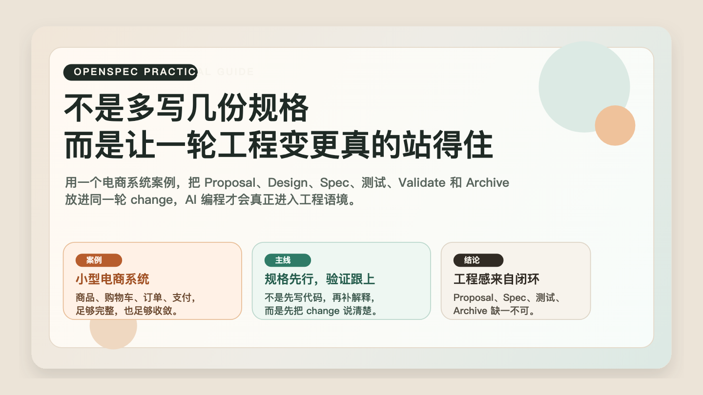

# OpenSpec 实战指南：用一个电商系统案例，看懂 AI 编程为什么必须回到规格与验证



我自己在用 AI 补页面、修 bug、改局部逻辑的时候，经常也会觉得一切都很顺。

但真正的工程难题，往往不是“这段代码能不能先写出来”，而是下面这些事情能不能一起成立：

- 需求边界有没有被说清楚
- 架构路径有没有提前想明白
- 系统行为有没有被写成可验证场景
- 实现完成之后，有没有办法确认它真的符合预期

这也是我这次重新梳理 OpenSpec 时最在意的地方。  
它不是在教我“怎么让 AI 多写一点代码”，而是在提醒我“怎么让 AI 参与一轮完整的软件工程变更”。

正式进入案例之前，我想先补一个版本提醒：

我这次重新核对版本时，最先确认的就是初始化流程。  
如果是看较早期的视频或教程，很多人会默认以为初始化完成后，还要把提示词手动复制进 AI 工具里，才能真正开始用。  
但按现在较新的 OpenSpec 初始化流程，像 Claude Code 这类已支持的工具，在执行完 `openspec init` 之后，通常已经会把 slash commands、skills 和相关配置直接准备好。

也就是说，**按我这次核对到的版本，很多场景下已经不需要再手动复制提示词，而是可以直接进入 `/opsx:propose` 这类命令驱动的工作流。**

所以如果视频里的操作步骤和本地实际输出不一样，我会更倾向于先看 `openspec init` 的终端结果，而不是先怀疑自己装错了。  
如果终端已经明确提示 commands / skills 已创建，并告诉我可以直接开始第一轮 change，那我就会把它判断为更新后的流程。

为了把这件事讲具体，这篇文章不是只停留在“看懂一篇案例”，而是结合了我这次实际核对过的一套工作区来展开。  
下文我统一把它称为“工作区”，重点看一轮变更怎样从需求建模、规格设计、系统实现、测试验证，一路走到最后归档沉淀。

这次我实际做过的验证主要包括：

- 跑通工作区里的 Node 版本单元测试、集成测试和性能基线测试
- 直接启动本地服务，手动走一轮“上架商品 -> 加购 -> 下单”的请求链路
- 对照外部实战文档里的 Proposal / Spec 示例，以及工作区里的 HTTP 路由和服务层代码，确认 Spec、实现与测试之间的映射关系

为了避免把“真实跑过的部分”和“后续整理出来的部分”混在一起，我也把这次过程单独整理成了一份留档：

- [[2026-03-24_OpenSpec工作区实战验证记录]]

也正因为如此，下面的代码例子和命令输出，不只是“适合写在文章里”，而是我这次实际核对过后挑出来的。

## 一、为什么实战里最先要做的，不是生成代码

我自己现在越来越警惕的一种错觉是：

只要需求说得够清楚，代码就可以直接往前长。

但真实项目里，最先出问题的往往不是代码实现速度，而是三类失真：

1. 需求边界在多轮对话里逐渐漂移
2. 设计决定留在聊天记录里，没有稳定落点
3. 做完之后没有明确证据证明实现真的符合预期

我这次越往下跑，越觉得 OpenSpec 的实战价值就在这里：它先把这些最容易失真的部分固定下来。

它要求你在实现之前，先完成一轮 change 的结构化表达：

- Proposal
- Design
- Spec
- Tasks

从我的理解看，这一步其实就是把“模糊意图”翻译成“可施工的变更单元”。

## 二、案例背景：为什么一个真实工作区更适合拿来做 OpenSpec 实战


我这次用于验证的，是一套以电商主链路为核心的工作区。之所以选这种业务场景，不是因为它“好懂”这么简单，而是因为它天然同时满足几件事：

- 业务边界清楚
- 核心流程完整
- 既有主路径，也有明显边界条件
- 能自然覆盖接口、状态、库存、订单、支付、测试这些工程问题

我这次看这个工作区时，会先把系统拆成几个核心上下文：

- `Catalog`：商品与库存
- `User`：身份识别
- `Cart`：购物车
- `Order`：订单
- `Payment`：支付

这几个上下文放在一起，恰好能构成一条完整业务主线：

用户浏览商品 -> 加入购物车 -> 提交订单 -> 扣减库存 -> 完成支付

它已经足够复杂，能够体现工程性；又没有复杂到需要大量外部依赖，特别适合拿来观察 OpenSpec 在真实变更中的作用。

如果把这个工作区按“规格 -> 实现 -> 验证”三层去看，大致会长成这样：

```text
<workspace-root>/
├── openspec/
│   ├── AGENTS.md
│   ├── project.md
│   └── changes/
│       └── v1-mvp/
│           ├── proposal.md
│           ├── design.md
│           ├── tasks.md
│           └── specs/
│               ├── api/spec.md
│               └── domain/spec.md
├── src/
│   ├── http/
│   ├── services/
│   ├── domain/
│   └── repo/
└── __tests__/
    ├── unit.spec.js
    ├── integration.spec.js
    └── performance.spec.js
```

我会特别看重这个结构，因为它天然把“这次准备怎么改”和“代码最终怎么落地”连起来了。

## 三、第一步不是动手实现，而是先写 Proposal，把范围和目标钉住

我这次回看这轮最小可用的 change，最先确认的也是：这次到底要做什么。

按我这次的理解，Proposal 至少要把下面几件事钉住：

- 说明为什么要做这轮业务闭环验证
- 说明这次 change 的范围
- 说明最小可交付目标
- 给出非功能性目标

例如，一个像样的最小目标可能会包括：

- 商品列表查询
- 购物车增删
- 订单创建
- 库存扣减

同时，Proposal 还应该明确哪些东西这次不做，例如：

- 搜索
- 推荐
- 真实支付网关
- 外部数据库集成

我会把这一步看得很重，因为它直接决定后面的系统会不会越做越散。

对我来说，实战里真正重要的从来不是“能不能先做出更多功能”，而是“能不能先把边界收住”。

这里我需要说清楚一件事：下面这段不是我本机直接跑出来的原始 `proposal.md`，而是我根据这次实际验证过的工作区边界，按 OpenSpec 的 Proposal 组织方式整理出来的一版精简示例。我已经把这部分和对应的验证输出一起单独留档在 [[2026-03-24_OpenSpec工作区实战验证记录]] 里，后面如果继续扩写正文，也会优先以那份记录为准。

```markdown
# Proposal: v1-mvp

## Why

需要一套规范化方式，确保人与 AI 对需求达成一致，
同时让代码、测试与规格保持同步。

## What Changes

- 商品列表查询
- 购物车管理
- 订单创建与库存扣减

## Goals

- 核心接口 p99 < 100ms
- 核心逻辑测试覆盖率 > 80%

## Scope

- In Scope: Catalog, Cart, Order, User
- Out of Scope: Search, Recommendation, Payment Gateway
```

这段东西看起来像文档摘要，但我这次越对照实现和测试，越能感觉到它真正的作用：  
后面 Design、Spec、实现、测试，都会被它约束。

## 四、第二步用 Design 把系统路径定下来，而不是让 AI 边写边想

在我看来，Proposal 负责回答“为什么做”，Design 负责回答“准备怎么做”。

我这次看这个工作区里的 Design，第一反应就是它先把系统分层想清楚了：

- HTTP 接口层
- 服务编排层
- 领域模型层
- 基础设施层

这四层的意义并不只是代码分目录，而是为了把职责拆开：

- 接口层处理请求、响应和错误码映射
- 服务层负责业务流程编排
- 领域层负责核心业务实体与规则
- 基础设施层负责存储实现

一旦这条依赖方向先被写进 Design，后面的实现就不太容易长成一团混合逻辑的大泥球。

这也是我这次会反复记住的一点：

**它不是让 AI 去猜架构，而是要求架构先落在 change 里。**

我这次最在意的也不是再解释一遍概念，而是先把目录映射关系对齐清楚：

```text
openspec/changes/v1-mvp/specs/api/spec.md   -> 对外接口契约
openspec/changes/v1-mvp/specs/domain/spec.md -> 领域规则
src/http/server.js                          -> HTTP 路由与错误映射
src/services/order.js                       -> 下单编排逻辑
__tests__/integration.spec.js               -> 场景级验证
__tests__/performance.spec.js               -> SLO 基线验证
```

对我来说，只要这个映射关系是通的，这篇实战复盘就不只是方法介绍，而是真的落在工程闭环上。

## 五、Spec 才是这轮实战的真正硬核部分

如果说 Proposal 是方向，Design 是路径，那我会把 Spec 看成这轮 change 最硬的一层契约。

这次对照工作区时，我会把 Spec 拆成两类内容来看：

### 1. 领域规则

例如：

- 商品必须有唯一标识
- `priceCents` 不能为负
- `stock` 不能为负
- 订单状态只能在约定状态之间流转

### 2. 行为场景

例如：

- 正常下单时应成功创建订单
- 库存不足时应返回明确错误
- 购物车为空时不能下单
- 支付成功后订单状态应发生变化

对我来说，这一步的价值不在于“写得多详细”，而在于：

- AI 知道系统行为应该被什么约束
- 测试知道该验证哪些场景
- 团队知道实现是不是偏离了原始 change

也正因为如此，我现在会特别重视 `Requirement + Scenario` 这种写法。  
它不是排版偏好，而是在把“系统怎么工作”写成一层能被实现和验证共同消费的结构。

这点在参考文档里的 Spec 片段上体现得很明显。我这次摘的代表性片段大概是这样：

```markdown
## ADDED Requirements

### Requirement: 订单创建

系统 SHALL 支持结算购物车生成订单，并处理库存扣减。

#### Scenario: 成功创建订单

Given 用户购物车中有商品
And 商品库存充足
When 发送 POST /api/orders 携带 { userId }
Then 返回状态码 201
And 返回新创建的订单 Order

#### Scenario: 创建订单时库存不足

Given 用户购物车中有商品
And 商品库存不足
When 发送 POST /api/orders 携带 { userId }
Then 返回状态码 409
And 返回错误信息 "Stock insufficient"
```

我会觉得这类写法最有价值的地方，就是它把“代码应该做什么”和“测试应该怎么验”同时钉住了。

## 六、实现阶段最重要的，不是把代码先堆出来，而是让代码去映射 Spec

很多工程方法一到实现阶段，就会重新回到“代码自由发挥”。

而我这次最认可 OpenSpec 的地方之一，就是它尽量不让这件事发生。

从我实际对照到的实现来看，一条比较稳的路径大概就是：

1. 先定义领域模型
2. 再补数据存储
3. 再实现服务编排
4. 最后暴露 HTTP 接口

这条顺序背后其实是一个很明确的工程判断：

先把系统语义稳定下来，再去接协议层和外部输入。

所以我这次看完整个工作区后，一个很强烈的感受就是：这种实现方式和“先把接口写出来再慢慢补逻辑”的冲动其实是相反的。  
它更像是在说：

先把系统内部约束写稳，再让外部调用落进来。

这也是为什么我会觉得，哪怕只是一个小型系统，OpenSpec 也很容易把它拉回比较干净的分层结构。

更关键的是，我在代码里能直接看到 Spec 的映射关系，而不是只能靠嘴解释。

例如下单服务层里，`createOrder` 就明确把“检查购物车 -> 校验库存 -> 生成订单 -> 清空购物车”这条链路写成了可执行逻辑：

```javascript
createOrder(userId) {
  const cart = this.cartRepo.findByUserId(userId)
  if (!cart || cart.items.length === 0) {
    throw new Error('CART_EMPTY')
  }

  let totalCents = 0
  const orderItems = []

  for (const item of cart.items) {
    const product = this.productRepo.findById(item.productId)
    if (product.stock < item.quantity) throw new Error('OUT_OF_STOCK')

    totalCents += product.priceCents * item.quantity
    orderItems.push({
      productId: item.productId,
      priceCents: product.priceCents,
      quantity: item.quantity
    })
  }

  // 扣减库存 -> 创建订单 -> 清空购物车
}
```

再往上一层，HTTP 路由又把 Spec 里的接口契约和错误语义映射成了明确的状态码：

```javascript
if (pathname === '/api/orders' && req.method === 'POST') {
  const body = await readJson(req)
  const userId = body.userId || 'user_dev'
  const order = orderService.createOrder(userId)
  return sendJson(res, 201, order)
}

if (e.message === 'OUT_OF_STOCK') {
  return sendError(res, 'OUT_OF_STOCK', '库存不足', 409)
}
```

这也是我这次最明确的判断：  
OpenSpec 真正带来的不是“多一份文档”，而是让实现更像在照着规格施工。

## 七、真正拉开质感差距的，是验证环节

很多 demo 跑到“能跑起来”就结束了。  
但我这次越往后验证，越觉得真正决定成色的不是跑起来，而是有没有证据证明它跑对了。

所以我这次不会把验证看成附加项，而会把它看成 change 本身的一部分。

按我这次实际跑下来的感受，至少要有三类验证：

### 1. 单元测试

验证领域规则与边界条件，例如：

- 库存扣减是否正确
- 非法输入是否被拦截

### 2. 集成测试

验证端到端链路，例如：

- 加购 -> 下单 -> 扣库存
- 支付 -> 更新订单状态

### 3. 基线指标

验证非功能性目标，例如：

- 核心接口延迟目标
- 基本吞吐要求

这部分对我来说特别重要，因为它把 OpenSpec 从“有规格的开发流程”推进成了“有验收闭环的工程流程”。

换句话说，Spec 不只是为了帮助 AI 写代码，它最终还要回到一个更硬的问题：

**这次 change，到底算不算真的完成。**

这次我实际跑过的验证，最能说明这件事。

先是整个工作区的测试套件：

```bash
cd <workspace-root>
npm test
```

我这次在本地跑到的结果是：

```text
▶ 集成测试 (E2E)
  ✔ 完整购物流程
✔ 集成测试 (E2E)
P99 Latency: 12.88ms
▶ 性能基线测试
  ✔ 下单接口 P99 < 100ms
✔ 性能基线测试
▶ 领域与服务单元测试
  ✔ 商品上架与列表
  ✔ 购物车添加逻辑
  ✔ 下单扣减库存
  ✔ 库存不足抛错
✔ 领域与服务单元测试
ℹ pass 6
ℹ fail 0
```

这组结果的价值非常直接：

- 它证明 Spec 对应的关键路径已经有单元、集成和性能三个层次的支撑
- 它不是“代码能运行”而已，而是“关键场景已经被验证”
- 它也让文章里关于 p99、库存扣减、下单链路的论证不再停留在口头层

换句话说，这次我重点实跑的是“工作区实现 + 测试 + 接口链路”这一层；  
而 OpenSpec 的工件组织、Proposal / Spec 结构和变更闭环，则是对照参考文档与工作区目录一起核对的。

如果只看测试文件还不够，我这次还手动打了一轮接口调用。下面这组输出，都是我直接启动服务后在本地请求拿到的：

```bash
POST /api/products 201
{"name":"Proof Item","priceCents":299,"stock":5,"id":"prod_kwh2h77z7"}

POST /api/cart/items 200
{"userId":"user_dev","items":[{"id":"item_j9ghaafgc","productId":"prod_kwh2h77z7","quantity":2}]}

POST /api/orders 201
{"id":"order_qvgy3uppr","userId":"user_dev","status":"PENDING_PAYMENT","totalCents":598,"items":[{"productId":"prod_kwh2h77z7","priceCents":299,"quantity":2}]}
```

库存不足的失败场景我也单独打过一次，返回结果是：

```bash
POST /api/orders 409
{"code":"OUT_OF_STOCK","message":"库存不足"}
```

写到这里，我自己会更有把握说这件事。  
因为它已经不再只是“这个方法理论上应该可行”，而是“这条工作区链路我已经实际跑过，状态码、返回体和性能基线都对得上”。

## 八、Archive 的意义，是把这轮 change 变成系统新的事实

如果一轮 change 只是完成实现，但没有被沉淀回主规格，我会觉得它还停留在“局部成功”的状态。

OpenSpec 的 Archive 机制，做的正是最后这一步：

- 把 change 从进行中状态收口
- 把关键规格回写进主规格
- 让项目回到“当前事实明确”的状态

这个动作看起来很平常，但我会把它看成整个实战链路里非常关键的一步。

因为没有 Archive，系统就会不断积累“悬空变更”。  
只有把 Archive 做完，项目才会真正形成一条稳定演进的主线。

## 九、为什么这套方法对 AI 编程特别有价值

如果没有 OpenSpec 这类中间层，我现在越来越容易在复杂任务里看到 AI 落进这几种状态：

- 局部很聪明
- 全局不稳定
- 一开始很快
- 越往后越依赖人工兜底

而我这次会觉得 OpenSpec 的实战价值，恰好就在于它给 AI 增加了一层护栏：

- Proposal 防止边界漂移
- Design 防止架构失控
- Spec 防止行为失真
- Validate 防止格式和结构失效
- Archive 防止结论无法沉淀

所以我现在最想带走的，不是“怎么写几份文件”，而是它怎样把 AI 编程重新拉回工程语境。

## 十、如果你真的要拿它做项目，最该借鉴什么

如果把这次工作区里最值得带走的东西压缩成几条，我自己会记住下面这些：

1. 先把一轮 change 说清楚，再让实现开始
2. 先把系统边界写清楚，再让 AI 去加速
3. 让 Spec 同时服务实现和测试
4. 把验证视为交付的一部分
5. 用 Archive 让变更真正结束

这几件事看起来都不花哨，但我会觉得它们恰恰构成了实战里最有价值的“质感差异”。

因为在我看来，真正成熟的软件工程，从来不是“把代码先写出来”，而是让一轮变更从意图、设计、实现到验证都站得住。

而这，也正是我这次最想借 OpenSpec 讲清楚的地方。

## 参考来源

- [[2026-03-23_link_openspec-practical-guide]]
