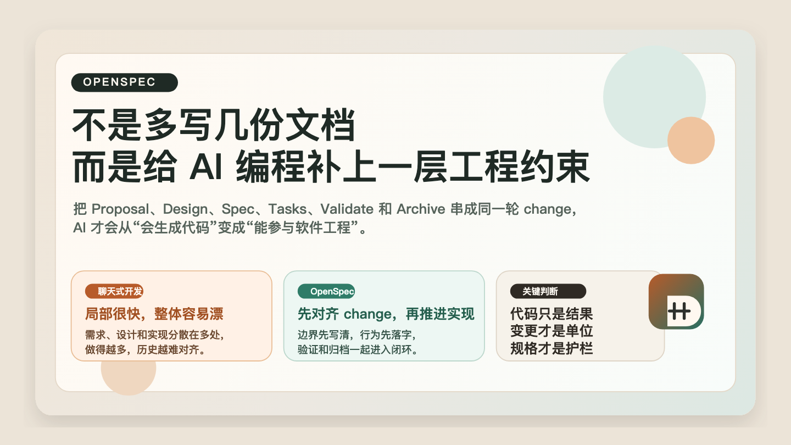
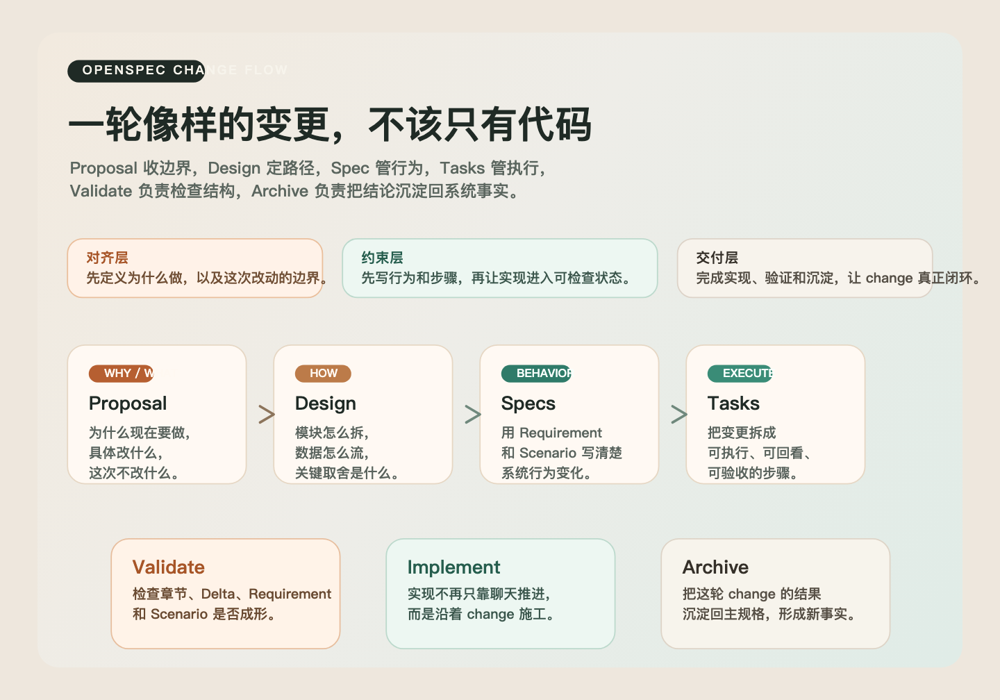
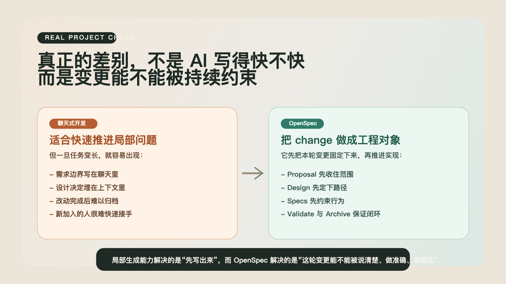

# OpenSpec 不是多写几份文档，而是在 AI 编程里补上一层工程约束

如果你已经认真用过一段时间 AI 编程助手，你大概率会发现一个很微妙、也很现实的落差。

在局部问题上，AI 往往表现得非常强。让它补一个组件、改一个接口、写一段测试、重构一小块逻辑，很多时候都能很快给出像样结果。

但一旦任务开始变长，变更开始变多，参与的人开始不止一个，问题就出现了。需求边界会漂，设计决定会丢，聊天上下文会失真，最后代码虽然还在增长，工程却不一定在变得更稳定。

从专业开发者的视角看，这其实不是“AI 写代码能力不够”的问题，而是缺少一层中间结构。你需要一种机制，把需求、设计、实现、验证和归档放进同一个变更单元里，而不是散落在聊天记录、临时文档和代码提交之间。

OpenSpec 的价值，就在这里。

它真正做的，不是教你多写几份 Markdown，而是给 AI 编程补上一层工程约束，让“这次到底在改什么、为什么改、按什么标准算完成”这件事，有一个稳定的落点。

## 一、OpenSpec 解决的，不是写代码，而是变更失真

很多人第一次看 OpenSpec，会先看到它的目录、命令和文档格式，然后下意识把它归类为一种“写规格的工具”。

这个理解太浅了。

真实项目里最棘手的问题，从来不是“代码能不能先写出来”，而是下面这些事情能不能始终对齐：

- 当前系统的事实到底是什么
- 这次变更到底想改什么
- 为什么要这样改，而不是那样改
- 哪些场景算完成，哪些场景算失败
- 变更结束之后，哪些结论应该沉淀下来

如果这些问题只存在于聊天记录里，AI 一定会越来越不稳。因为聊天天生适合推进局部动作，不适合长期承载项目级约束。

OpenSpec 的第一层判断很成熟：  
**AI 编程真正缺的不是输出通道，而是规格化的中间层。**

## 二、它最重要的设计，不是命令，而是把“当前事实”和“进行中的变更”分开

在 OpenSpec 的思路里，项目不是只有一堆说明文档，而是被拆成两个非常不同的区域：

`openspec/specs/`

- 存放系统当前已经成立的事实
- 它描述的是“现在这个系统应该如何工作”

`openspec/changes/`

- 存放这一次次正在推进的变更
- 它描述的是“这次准备怎么改，以及为什么这样改”

这个分层看起来简单，但工程意义很大。

因为很多团队真正缺的不是“有没有文档”，而是没有把“当前系统”与“本次改动”区分开。于是最后就会出现一种很常见的混乱：

- 老规则和新方案写在一起
- 已经上线的能力和还在讨论中的能力写在一起
- 需求、设计、实现、验证彼此脱节

OpenSpec 通过 `specs/` 和 `changes/` 的拆分，先把这件事理顺了。  
这也是为什么它看起来只是目录设计，但实质上是在约束团队的思考方式。

## 三、在 OpenSpec 里，真正的工作单元不是“功能”，而是“变更”

专业开发者会很自然地理解这一点。

软件开发从来不是“我实现了一个功能”这么简单，而是一次次可追踪、可讨论、可验证的变更。OpenSpec 很准确地抓住了这一点，所以它不是围绕“页面”或者“模块”组织工作，而是围绕 change 组织协作。

一个像样的 change，通常包含四类工件：

`proposal.md`

- 回答为什么做
- 说明这次改动的范围和目标

`design.md`

- 回答怎么做
- 说明技术路径、边界拆分和关键取舍

`specs/`

- 回答系统行为到底要发生什么变化
- 用 Requirement 和 Scenario 把约束写清楚

`tasks.md`

- 回答实施顺序是什么
- 把执行过程拆成可以落地的动作清单

这四类工件看起来像文档，实际上更像四种不同层级的工程约束：

- `proposal` 约束问题边界
- `design` 约束实现路径
- `specs` 约束系统行为
- `tasks` 约束执行顺序

如果缺任何一层，AI 都可能“看起来在推进，实际在漂移”。

## 四、为什么这套结构对 AI 特别重要

传统开发里，很多隐性经验可以靠工程师自己补。你大概知道哪里是历史包袱，哪里是关键边界，哪里是绝对不能碰的接口。

但 AI 不是这样工作的。

AI 很擅长在当前上下文里做局部最优推断，却天然缺少长期稳定的项目记忆。于是它的几个弱点会在真实项目里被放大：

1. 它会把最近一次对话当成最强信号
2. 它会在模糊空间里自动补全“合理答案”
3. 它很难持续记住过去的设计决定

OpenSpec 的价值，恰好就是把这些最容易丢的东西，外置成工件。

从这个角度看，OpenSpec 更像一层协作协议：

- 人负责定义边界和判断结果
- AI 负责在边界内加速分析与实现
- 工件负责保存决定，而不是让决定淹没在聊天记录里

所以它最核心的价值，不是“让 AI 更会写”，而是“让 AI 不那么容易偏”。

## 五、真正专业的地方，在于它把实现和验证连在了一起

很多工具都能帮你写需求，也有很多框架能帮你生成模板。  
但 OpenSpec 比较难得的一点，是它没有把规格当成写完就结束的前置材料，而是把它放进了完整迭代链路里。

在两篇参考文档里，你能明显看到一条主线：

1. 先建立变更
2. 先把 Proposal、Design、Spec、Tasks 写清楚
3. 再进入实现
4. 再做验证
5. 最后 archive，回到主规格

这条链路的重要性在于，OpenSpec 不只是解释“要怎么规划”，还在回答：

- 什么时候该开始实现
- 什么时候该检查规格完整性
- 什么时候该把变更从进行中状态收束为项目事实

这和很多 demo 级方法最大的区别就在这里。

Demo 级方法通常只解决“怎么开始”。  
OpenSpec 更像是在解决“怎么结束一轮可靠的工程变更”。

## 六、它为什么比很多“AI 写代码流程”更适合真实项目

如果只做一次性 demo，AI 对话就够了。  
但只要进入真实项目，下面这些需求几乎都会出现：

- 需要追溯这次为什么改
- 需要让别人快速接手上下文
- 需要把行为边界写清楚
- 需要在改动完成后把结果沉淀下来

OpenSpec 之所以更接近真实工程，不是因为它更复杂，而是因为它承认了一件事：

**软件开发的最小可靠单位，不是“生成一段代码”，而是“完成一轮可审查的变更”。**

这也是为什么它很适合存量项目。

在 brownfield 场景里，你最怕的不是“AI 不会写代码”，而是：

- 它不理解旧系统的约束
- 它把局部修改扩成系统性扰动
- 它改完之后没人说得清发生了什么

用 change 驱动而不是直接让 AI 自由发挥，本质上就是在给存量系统加护栏。

## 七、OpenSpec 真正适合怎么用

把它用得太轻，会沦为形式。  
把它用得太重，又会重新掉回流程主义。

更合理的方式是把它当成一条“中等复杂度以上任务”的标准工作流。

我更推荐这样理解：

- 很小的修字、样式微调、一次性脚本，不一定需要完整 OpenSpec
- 只要任务已经涉及多个步骤、多个场景、多人接力或长期维护，就值得进入 change

一个更稳的使用姿势通常是：

1. 先初始化项目
2. 为这次改动创建 change
3. 先写 proposal，收范围
4. 再写 design 和 spec，把路径与行为定清楚
5. 再拆 tasks，进入实现
6. 跑验证
7. archive 回主规格

这套顺序看似多了一步，实际是在减少返工。

## 八、最容易被误用的地方

### 1. 把 OpenSpec 用成“更完整的需求文档”

如果写完 proposal 和 design 就结束，那它只是文档整理，不是工程闭环。

### 2. 只记命令，不管工件质量

会用 `init`、`validate`、`archive` 不代表真正掌握了 OpenSpec。  
真正决定效果的，还是 proposal 有没有收住边界，spec 有没有写出行为，tasks 有没有可执行性。

### 3. 先写代码，再倒补规格

这样当然也能留痕，但它已经失去了 OpenSpec 最强的那部分价值：  
在实现之前就对齐。

### 4. 对所有小事都强行上完整流程

这会让团队把 OpenSpec 理解成负担，而不是护栏。  
它应该服务关键变更，而不是吞掉全部日常动作。

## 九、如果你只记住一句话

OpenSpec 最值得借鉴的，不是它有哪些命令，而是它对 AI 软件工程做出的那个核心判断：

**人和 AI 之间，不能只有 prompt 和代码，中间还需要一层可审查、可验证、可归档的规格工件。**

一旦你接受这一点，很多事情会立刻变得清楚：

- 为什么很多 AI 编程一开始很快，后面却越来越乱
- 为什么真实项目需要比聊天更稳定的上下文
- 为什么 change、spec、validate、archive 这些动作不是负担，而是工程秩序的一部分

所以 OpenSpec 不是“多写几份文档”。  
它真正提供的，是一条把 AI 编程拉回工程语境的主线。

## 参考来源

- [[2026-03-23_link_openspec-practical-guide]]
- [[2026-03-23_link_openspec-e4-bd-bf-e7-94-a8-e6-89-8b-e5-86-8c]]
