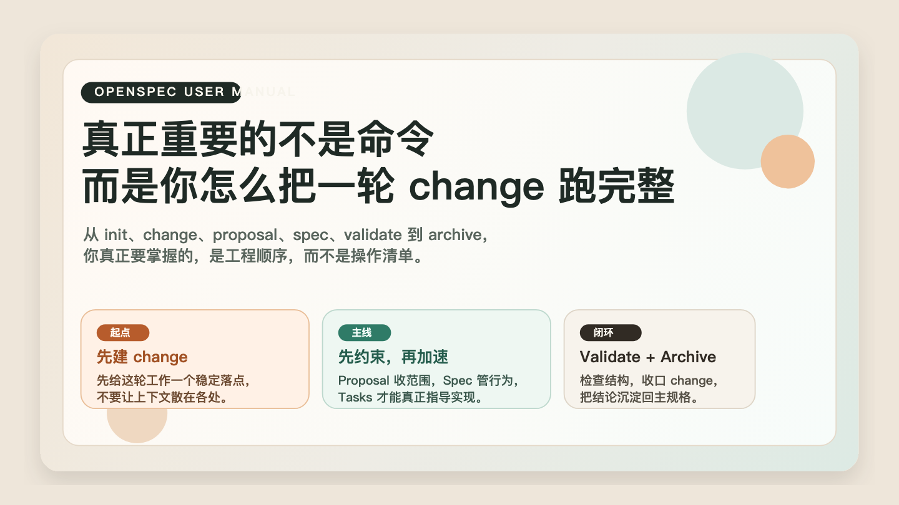
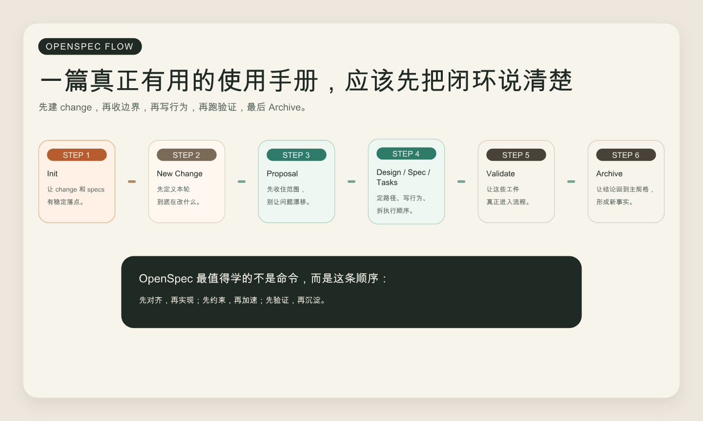

# OpenSpec 使用手册：真正重要的不是命令，而是你怎么把一轮 change 跑完整



很多人第一次接触 OpenSpec，最容易把注意力放在命令上。

`init` 怎么用，`validate` 什么时候跑，`archive` 又会把东西放到哪里。  
这些当然重要，但如果只停留在这一层，你很快就会发现一个问题：

你可能记住了命令，却没有真正理解 OpenSpec 在管理什么。

OpenSpec 管的不是“文档写得全不全”，也不是“AI 能不能再多生成一点代码”。  
它真正管理的是一轮变更从开始、对齐、实现、验证到归档的全过程。

所以这篇手册不会把它写成一份干巴巴的命令速查，而是尽量沿着真实工程路径展开：  
**从规范驱动开发的基本理解开始，一步走到 change 的创建、验证、实现和归档闭环。**

## 一、OpenSpec 到底是什么

OpenSpec 可以把它理解成一个面向 AI 编程协作的规范驱动开发框架。

传统开发经常是：

需求 -> 直接编码 -> 测试 -> 返工

而 OpenSpec 试图把流程改成：

需求 -> 编写规范 -> 验证规范 -> 编码实现 -> 归档沉淀

这背后的核心判断很简单：

- 代码只是结果
- 变更才是单位
- 规格是变更的护栏

如果你和 AI 还没有先对“这次到底改什么、为什么改、什么算完成”达成一致，那么实现越快，返工往往也越快。

### OpenSpec 的四个核心理念

| 理念 | 你可以怎么理解 |
| --- | --- |
| 流动而不是僵化 | 文档不是一次写死，可以随着认知推进逐步修正 |
| 迭代而不是瀑布 | 可以从一个 change 开始，小步推进，而不是先写完全部需求 |
| 简单而不是复杂 | 主要依赖 Markdown，不要求上手一套重工具链 |
| 同时兼容存量项目和新项目 | 既可以逐步接入已有仓库，也适合从零建立规范体系 |

这也是为什么很多人把 OpenSpec 用顺手之后，会发现它真正提升的不是“写文档效率”，而是 AI 协作的可控性。

## 二、安装：先把 CLI 跑起来

### 1. 前置要求

开始之前，至少确认两件事：

- Node.js 版本在 `20.19.0` 或更高
- 你本地有可用的包管理器，比如 `npm`、`pnpm`、`yarn` 或 `bun`

如果不确定 Node 版本，可以先检查：

```bash
node --version
```

### 2. 安装命令

最常见的安装方式是：

```bash
npm install -g @fission-ai/openspec@latest
```

如果你更习惯其他包管理器，也可以：

```bash
# pnpm
pnpm add -g @fission-ai/openspec@latest

# yarn
yarn global add @fission-ai/openspec@latest

# bun
bun install -g @fission-ai/openspec@latest
```

### 3. 验证安装

安装完成后，至少跑一次：

```bash
openspec --version
openspec --help
```

如果这两条都能正常返回，说明 CLI 已经可用。

## 三、项目初始化：不是为了多一个目录，而是给 change 找到落点

在项目根目录下执行：

```bash
openspec init
```

如果你不想进入交互流程，也可以直接：

```bash
openspec init --tools none
```

### 1. 交互式配置在做什么

`openspec init` 默认会询问你要不要为不同 AI 工具生成配套配置，例如 Claude Code、Cursor、GitHub Copilot、Cline、Windsurf 等。

如果你是在 IDE 里接入 OpenSpec，这一步是有价值的，因为它会顺手把相关指引文件准备好。  
如果你只是先把目录跑起来，或者准备放进脚本、CI/CD 里，直接用非交互模式通常更省事。

这里有一个很值得单独提醒的版本差异：

如果你看到的是较早期的视频或教程，可能会以为初始化完成后，还要把一段提示词手动复制到 AI 工具里才能开始用。  
但按现在较新的 OpenSpec 初始化流程，像 Claude Code 这类已支持的工具，执行完 `openspec init` 之后，通常已经会把对应的 slash commands、skills 和配置文件直接生成好。

也就是说，**当前版本里，很多场景下你不需要再手动复制提示词，而是可以直接开始使用。**

例如你在 Claude Code 里完成初始化后，通常会直接看到类似“已创建 commands / skills，可以开始用 `/opsx:propose`”这样的提示。  
如果你发现命令没有立刻生效，更常见的原因不是“还要手工复制提示词”，而是需要按提示重启一下 IDE 或会话环境。

常见写法有三种：

```bash
# 不配置任何工具
openspec init --tools none

# 配置全部支持的工具
openspec init --tools all

# 只配置指定工具
openspec init --tools claude,cursor
```

### 2. 初始化后的目录结构

初始化之后，最关键的通常是这几个位置：

```text
your-project/
├── .openspec/
├── openspec/
│   ├── AGENTS.md
│   ├── project.md
│   ├── changes/
│   └── specs/
└── ...
```

它们分别在解决不同问题：

| 目录 / 文件 | 作用 |
| --- | --- |
| `.openspec/` | OpenSpec 的内部配置与元数据 |
| `openspec/AGENTS.md` | 告诉 AI 在这个仓库里该如何遵循 OpenSpec 工作流 |
| `openspec/project.md` | 项目背景、技术栈、约束和上下文 |
| `openspec/changes/` | 活跃中的变更提案，按 change 分目录管理 |
| `openspec/specs/` | 已归档、已经成立的系统事实 |

这里最值得理解的是 `changes/` 和 `specs/` 的区别。

`changes/` 管的是“这次准备怎么改”；  
`specs/` 管的是“系统现在应该怎样工作”。

这不是目录美学，而是在避免三个特别常见的混乱：

- 旧事实和新方案混在一起
- 已完成结论和讨论中结论混在一起
- 需求、实现、验证彼此脱节

## 四、创建变更提案：真正的起点不是写代码，而是先创建 change

初始化之后，下一步不是让 AI 直接开始实现，而是先为这轮工作创建一个变更单元：

```bash
openspec new change <change-name>
```

例如：

```bash
openspec new change add-session-timeout-warning
```

### 1. change 名字怎么起

比较稳的命名习惯是：

- 使用 `kebab-case`
- 名字直接体现改动意图

可以参考下面这组对比：

```bash
# 更好的命名
openspec new change user-authentication
openspec new change add-payment-module
openspec new change fix-login-timeout

# 不太好的命名
openspec new change feature1
openspec new change test-change
openspec new change update-ui
```

一个好名字最直接的价值是：  
你几个月之后再看到它，依然能大致猜到当时在解决什么问题。



### 2. 创建后会得到什么

一轮新的 change，通常会长成这样：

```text
openspec/changes/<change-name>/
├── .openspec.yaml
├── proposal.md
├── design.md
├── tasks.md
└── specs/
    └── <capability>/
        └── spec.md
```

这几个文件分别扮演不同角色：

| 文件 | 作用 | 是否关键 |
| --- | --- | --- |
| `proposal.md` | 解释为什么做、这次具体改什么 | 必需 |
| `design.md` | 解释准备怎么实现、涉及哪些技术取舍 | 推荐 |
| `tasks.md` | 把方案拆成可执行动作 | 推荐 |
| `specs/<capability>/spec.md` | 定义行为要求和验收场景 | 必需 |
| `.openspec.yaml` | 记录 change 元数据，由 CLI 管理 | 自动生成 |

### 3. 一轮 change 的生命周期

OpenSpec 最核心的一条链路，其实很简单：

创建 -> 编写规范 -> 验证 -> 实现 -> 归档

对应命令通常就是：

```bash
openspec new change <name>
openspec validate <name>
openspec archive <name>
```

实现动作发生在中间，但真正的工程意义在于：  
你不是“想到哪里改到哪里”，而是在沿着一个明确可验证的 change 推进。

## 五、文档结构规范：Proposal、Spec、Design、Tasks 分别在管什么

很多人第一次接触 OpenSpec 时，最容易疑惑的是：  
为什么要分这么多文件？是不是太重了？

如果只从“写文档数量”看，确实会觉得多。  
但从工程分工看，它们各自承担的是不同约束。

### 1. proposal.md：先收住边界

`proposal.md` 最核心的任务，不是写背景故事，而是先把这次 change 的边界收住。

至少要回答四个问题：

- 为什么现在要做这件事
- 这次准备具体改什么
- 这次明确不改什么
- 用什么标准判断它算完成

OpenSpec 的验证规则里，通常最基本的是要有这两个章节：

```md
## Why
## What Changes
```

如果这两块都说不清楚，后面的实现很容易发散，因为 AI 会主动替你补足假设。

### 2. specs/：把能力拆成能力文件夹

`specs/` 目录下，不建议把所有内容直接塞进一个根目录文件，而是按能力拆分成文件夹：

```text
specs/
├── user-authentication/
│   └── spec.md
├── session-management/
│   └── spec.md
└── audit-logging/
    └── spec.md
```

这里的经验法则可以记成一句话：

**一个能力一个文件夹，一个能力文件夹里再放一份 `spec.md`。**

这样做的好处是：

- 能力边界更清楚
- 以后回看和扩展更方便
- 验证器也更容易正确理解结构

### 3. spec.md：真正硬核的部分是 Requirement + Scenario

Spec 不是把需求写得更长，而是把系统行为写成可约束、可验证的形式。

最常见的骨架是：

```md
## ADDED Requirements

### Requirement: 登录超时前给出提醒

系统 SHALL 在用户会话即将超时时给出可见提醒。

#### Scenario: 正常提醒

Given 用户处于已登录状态
And 会话还有 2 分钟到期
When 系统检测到会话接近超时
Then 页面显示提醒信息
And 用户可以选择继续会话
```

这套格式最关键的不是“看起来更正式”，而是它把行为边界说清楚了。

- `Requirement` 负责定义能力
- `Scenario` 负责定义行为
- `Given / When / Then` 负责把验收条件写成可检查的路径

一旦有了 Scenario，AI 在实现时就不容易只盯着主路径，而漏掉边界情况。

### 4. design.md：不是可选附件，而是防止 AI 自己发明架构

`design.md` 没有像 Spec 那么硬的格式要求，但它特别适合回答这些问题：

- 模块边界怎么拆
- 数据流怎么走
- 会影响哪些层
- 这次有哪些技术取舍
- 如何和现有系统兼容

如果 Proposal 回答的是“为什么改”，Spec 回答的是“系统要表现成什么样”，那么 Design 回答的就是：

**准备怎么实现这轮 change。**

### 5. tasks.md：把抽象方案翻译成施工顺序

`tasks.md` 不是装饰，它是在补一层“怎么推进施工”的信息。

一份有用的任务清单，通常有三个特点：

- 每项都足够具体
- 前后依赖关系清楚
- 做完之后能判断是否完成

更实用的写法，通常不是“大而全计划书”，而是按里程碑组织成一组连续可执行动作。

## 六、Validate 与常见错误：让规范真正进入工程流程

规范写完之后，不要直接跳到实现。  
先跑一次验证：

```bash
openspec validate <change-name>
```

这一步的意义，不只是检查格式，而是在确认这些 Markdown 真的可以进入后续工程流程。

### 1. 最常见的四类错误

#### 错误一：缺少 `## Why` 或 `## What Changes`

这通常意味着 `proposal.md` 还没有把“为什么做”和“具体改什么”说清楚。

#### 错误二：`specs/` 目录结构不对

比如把 `spec.md` 直接放在 `specs/` 根目录，而不是放进能力文件夹里，验证器很可能找不到有效 Delta。

#### 错误三：Requirement 标题格式不对

像下面这种都容易出问题：

```md
### REQ-001: Login
### login requirement
### requirement: Login
```

更稳的写法是：

```md
### Requirement: 登录超时提醒
```

#### 错误四：Requirement 下没有 Scenario

OpenSpec 不是只看你有没有写“需求说明”，它还关心你有没有把行为场景写出来。  
只有 Requirement 没有 Scenario，通常意味着这份 Spec 还不够可验证。

### 2. 调试时可以用的两个命令

如果你明明写了内容，但 `validate` 还是失败，可以先查两件事：

```bash
openspec change show <change-id> --json --deltas-only
openspec status --change <change-name>
```

前者更适合看解析结果，后者更适合看当前 change 的整体状态。

### 3. 一份很实用的验证前检查单

在跑 `validate` 之前，先过一遍下面这几个点，通常能省掉很多来回调试时间：

- `proposal.md` 是否包含 `## Why`
- `proposal.md` 是否包含 `## What Changes`
- `specs/` 下是否用了能力文件夹
- 每个 `spec.md` 是否有 `## ADDED` / `## MODIFIED` / `## REMOVED Requirements`
- 每个 Requirement 是否使用了 `### Requirement: <标题>` 格式
- 每个 Requirement 是否至少有一个 `#### Scenario: <标题>`
- 每个 Scenario 是否用了 `Given / When / Then`

## 七、常用命令参考：先掌握最少的一组

如果你刚开始上手，其实不用一次背完所有命令。  
先把最常用的一组记住就够了。

### 1. 初始化与创建

| 命令 | 用途 |
| --- | --- |
| `openspec init` | 初始化项目 |
| `openspec init --tools none` | 跳过工具配置直接初始化 |
| `openspec new change <name>` | 创建一轮新的 change |

### 2. 查看与验证

| 命令 | 用途 |
| --- | --- |
| `openspec validate <name>` | 验证 change 文档结构 |
| `openspec status --change <name>` | 查看某个 change 的状态 |
| `openspec list --changes` | 查看所有 change |
| `openspec list --specs` | 查看已归档 specs |
| `openspec view` | 打开交互式界面 |

### 3. 归档与管理

| 命令 | 用途 |
| --- | --- |
| `openspec archive <name>` | 归档已完成的 change |
| `openspec update` | 更新 AI 指导文件 |
| `openspec config` | 查看或修改配置 |

如果只允许你先记三条，那我会建议是：

```bash
openspec init --tools none
openspec new change <name>
openspec validate <name>
```

等真正把第一轮 change 跑完，再去把 `archive` 和更多辅助命令补上，会顺很多。

## 八、最佳实践：让 OpenSpec 真正适合和 AI 一起工作

### 1. Proposal 的最佳实践

更稳的写法通常是：

- 先写 Why，再写 What
- 明确 In Scope 和 Out of Scope
- 用完成标准收住边界
- 让 AI 看完后能知道“这次不要顺手多做什么”

比较容易踩坑的写法是：

- 只写抽象背景，不写边界
- 用“优化体验”“提升性能”这种模糊表达
- 把设计细节全塞进 Proposal，反而让结构失焦

### 2. Spec 的最佳实践

高质量 Spec 往往有这几个特点：

- 一个能力一个文件夹
- 每条 Requirement 都是可测试的单一能力点
- Scenario 足够具体，不写“系统应该正常工作”这种空话
- 有边界场景，而不是只有主路径

### 3. 与 AI 协作的最佳实践

OpenSpec 最适合的使用方式，不是“先让 AI 直接开写，再回头补文档”，而是：

1. 先让 AI 阅读 `proposal.md` 和 `specs/`
2. 再让 AI 根据具体能力或章节实现
3. 每完成一段，就回到规范检查一致性
4. 变更完成后及时归档

如果你使用支持 Slash Commands 的工具，也可以留意这些常见命令：

```text
/opsx:propose
/opsx:apply
/opsx:archive
```

它们的价值不是“多一层命令包装”，而是把提案、实现、归档这些动作进一步标准化。

这里也建议顺手补一句现实经验：

如果你是按照旧视频在学 OpenSpec，看到“初始化后还要再复制提示词”这类步骤，先不要急着照搬。  
更稳的判断方式是看你当前 `openspec init` 的实际输出结果。

如果初始化结果已经明确告诉你：

- 已经为 Claude Code 之类的工具创建了 commands
- 已经生成了对应 skills
- 可以直接从 `/opsx:propose` 之类的命令开始

那就说明你当前用的是更新后的流程，应该直接进入 slash command 工作流，而不是再回头手工复制一轮提示词。

### 4. 团队协作时特别该检查什么

如果 OpenSpec 已经进入团队协作阶段，代码审查时至少多看一眼下面这些点：

- Proposal 有没有清楚说明 Why 和 What
- 每个 Requirement 有没有至少一个 Scenario
- Scenario 是否真的可验证
- 重要边界场景有没有遗漏
- 变更完成后有没有及时 Archive

## 九、第一次上手，最稳的一条练习路径

如果你第一次真正把 OpenSpec 用进项目，不要一上来就挑一个特别大的需求。

更稳的练法是：

1. 先挑一个中等复杂度、边界清楚的 change
2. 跑 `openspec init`
3. 跑 `openspec new change <name>`
4. 写 `proposal.md`
5. 补 `design.md`
6. 写 `specs/`
7. 补 `tasks.md`
8. 跑 `openspec validate <name>`
9. 再进入实现
10. 最后 `openspec archive <name>`

你真正需要掌握的，不是命令本身，而是这条顺序背后的工程含义：

- 先对齐，再实现
- 先约束，再加速
- 先验证，再沉淀

这才是 OpenSpec 这类工具最值得带走的部分。

## 十、几个高频问题

### 1. OpenSpec 和 OpenAPI / Swagger 是一回事吗

不是。

OpenSpec 更像是在开发前期帮助你定义需求、边界和行为；  
OpenAPI / Swagger 更偏向接口层的定义和文档化。

两者可以配合，而不是互相替代。

### 2. 已有项目还能引入 OpenSpec 吗

可以，而且很适合从一个 change 开始渐进接入。

不需要一开始就把全仓库所有历史功能都补成 Spec。  
更现实的方式是：从下一个要做的需求开始，逐步建立 change 和 specs 的秩序。

### 3. 规范都写了，但 AI 还是不遵循怎么办

先检查三件事：

- 仓库里有没有清晰的 `AGENTS.md`
- 你有没有明确让 AI 先阅读当前 change 下的文档
- 规范写的是不是足够具体，而不是只给了抽象目标

很多时候不是 AI 不愿意遵循，而是约束本身还不够可执行。

### 4. 多个 change 可以同时存在吗

可以。

但更稳的做法是：

- 尽量减少强依赖关系
- 每个 change 的边界尽量独立
- 完成一个就及时 Archive，一个仓库里不要长期堆太多“半完成状态”的 change

## 参考来源

- [[2026-03-23_link_openspec-e4-bd-bf-e7-94-a8-e6-89-8b-e5-86-8c]]
- <https://github.com/Fission-AI/OpenSpec>
- <https://www.npmjs.com/package/@fission-ai/openspec>
