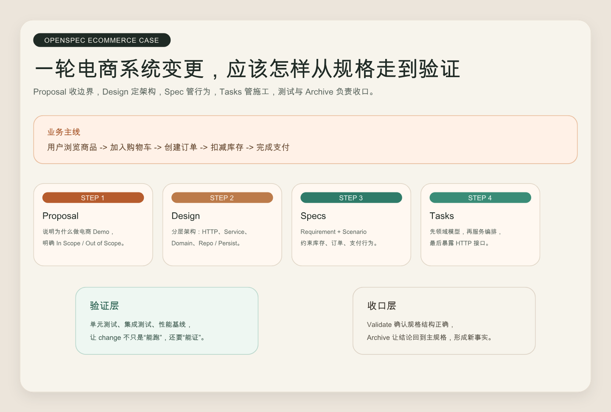

# OpenSpec 实战指南：我怎么维护一个可跑、可验、可继续演进的电商案例


这篇文章我不想再写成一份"概念介绍"。

这次我重新梳理了一套 OpenSpec 风格的电商系统——变更工件、Node 实现、测试验证全部对了一遍。

维护这种实战案例我最怕两件事：

- 文档写得很完整，但代码根本没对上
- 文章写得很热闹，但实际没有跑过

所以这篇实战指南只写我核对过、跑通过、并且愿意用第一人称负责的部分。

## 一、我这次到底拿什么来做 OpenSpec 实战

这次手上维护的是一套完整的系统。

```text
system/
├── openspec/
│   └── changes/
│       └── v1-mvp/
│           ├── proposal.md
│           ├── design.md
│           ├── tasks.md
│           └── specs/
│               ├── api/spec.md
│               └── domain/spec.md
└── app/
    ├── src/
    ├── __tests__/
    └── package.json
```

这次没把时间花在解释 OpenSpec 概念上。主要工作是把这套系统里的上下两层接起来。

- 上层是变更工件
- 下层是 Node.js 电商实现
- 中间用测试、接口返回和目录映射把它们对齐

上下两层对得上，这篇文章才不算二次转述。

## 二、我先维护 Proposal，不先维护代码

我现在越来越不相信一种做法。需求大概对了，就让 AI 先把代码长出来——这种思路在小 demo 能跑，到真实工程里很容易翻车。

维护这个案例时，我最先回看的不是 `server.js`，是这轮 change 的 `proposal.md`。Proposal 不是背景材料。它给这轮 change 划了边界——做哪些、不做哪些、卡哪些指标，写清楚之后后续才不容易跑偏。

这个案例的 Proposal 我会重点核三件事——为什么做、做哪些、不做哪些。

为什么做：

- 一个验证 OpenSpec 落地方式的实战案例
- 解决"人与 AI 缺少统一沟通语言，代码和文档容易脱节"的问题

做哪些：

- 商品列表查询与上架
- 购物车管理
- 下单结算与库存扣减
- 支付模拟
- 基础身份识别
- 内存存储与文件持久化扩展

不做哪些：

- 搜索与推荐
- 真实支付网关
- 后台管理界面
- 分布式部署

Proposal 里还有一层 SLO 约束。

- 核心接口 p99 < 100ms
- 支持 50 RPS
- 核心逻辑测试覆盖率 > 80%

这一步不是补文档。它把这轮 change 的工程目标定下来。工程目标不稳，后面的 Design、Spec、实现和测试都会开始飘。

## 三、Design 用来防止 AI 边写边发明架构



Proposal 把 Why 和 Scope 定下来之后，我接着看 `design.md`。

这个案例的设计不复杂。它做对的一件事——先写依赖方向，再让实现开始。

这版 `design.md` 是一个标准的四层结构。

- `http/`：处理请求、参数、状态码和响应格式
- `services/`：编排业务用例
- `domain/`：承载纯业务规则
- `repo/` 与 `persist/`：承载存储实现

这次我刻意把一个判断写进正文：

**OpenSpec 把分层方式和依赖方向写进 change，让实现有明确边界。多写几份 Markdown 反而会让 change 越变越散。**

回头对照实现目录时，我会特别看下面这组映射关系。

```text
openspec/changes/v1-mvp/design.md         -> 分层与数据流
openspec/changes/v1-mvp/specs/api/spec.md -> 接口契约
openspec/changes/v1-mvp/specs/domain/spec.md -> 领域约束
openspec/changes/v1-mvp/tasks.md          -> 实施与验证清单

src/http/server.js                        -> 开发态 HTTP 入口
src/services/catalog.js                   -> 商品能力
src/services/cart.js                      -> 购物车能力
src/services/order.js                     -> 下单编排
src/repo/memoryRepo.js                    -> 内存存储
src/http/server.prod.js                   -> 生产扩展草稿
src/persist/fileStore.js                  -> 文件持久化
__tests__/unit.spec.js                    -> 单元验证
__tests__/integration.spec.js             -> 集成验证
__tests__/performance.spec.js             -> 性能基线
```

这组映射通了，AI 写出来的内容才不容易变成"会说不会落"。

## 四、我在维护 Spec 时，最重视的是把"已实现"和"待扩展"分开写

回看 `specs/api/spec.md` 和 `specs/domain/spec.md` 时我有一个明确感受。Spec 比当前开发态服务更完整。

例如 API Spec 里写了这些能力：

- `GET /api/products`
- `POST /api/products`
- `POST /api/cart/items`
- `DELETE /api/cart/items/:id`
- `POST /api/orders`
- `GET /api/orders/:id`
- `POST /api/payments/:orderId`
- 幂等性创建订单
- 标准错误响应格式

但回到这次实际跑的 `src/http/server.js`，我会很诚实地把状态拆成三层。

第一层是已经跑通的主链路。

- 商品上架与列表
- 加购
- 下单
- 查询订单
- `CART_EMPTY` / `OUT_OF_STOCK` / `PRODUCT_NOT_FOUND` 的错误映射

第二层是 Spec 已写、但服务里还没完全落的部分。

- 支付接口
- 删除购物车条目
- 幂等性订单创建

第三层是 `server.prod.js` 和 `fileStore.js` 里已经露出来的扩展方向。

- 基础鉴权
- 文件持久化
- metrics
- idempotency check 的预留位置

我特别在意这点。维护实战案例最怕把设计态、规划态、已实现态混着写。看起来文章很完整，一对源码就露馅。

### 1. 领域规则，我重点看这三件事

领域 Spec 里有工程含金量的部分是约束，不是名词解释。

- 库存扣减后不能为负
- 购物车单商品数量不能超过 99
- 订单总价必须等于 `price * quantity` 的累加

这些约束在代码里都能找到对应落点。

比如 `CartService` 里这段数量上限校验，我会把它当成领域规则已经进入实现的证据。

```javascript
if (existing) {
  if (existing.quantity + quantity > 99) {
    throw new Error('MAX_QUANTITY_EXCEEDED')
  }
  existing.quantity += quantity
} else {
  if (quantity > 99) throw new Error('MAX_QUANTITY_EXCEEDED')
  cart.items.push({
    id: `item_${Math.random().toString(36).substr(2, 9)}`,
    productId,
    quantity
  })
}
```

再看 `OrderService#createOrder`。它不是单纯拼订单对象——先做库存校验，再计算总价，再扣库存，最后清空购物车。

```javascript
createOrder(userId) {
  const cart = this.cartRepo.findByUserId(userId)
  if (!cart || cart.items.length === 0) {
    throw new Error('CART_EMPTY')
  }

  let totalCents = 0
  const orderItems = []

  for (const item of cart.items) {
    const product = this.productRepo.findById(item.productId)
    if (!product) throw new Error(`Product ${item.productId} not found`)
    if (product.stock < item.quantity) throw new Error('OUT_OF_STOCK')

    totalCents += product.priceCents * item.quantity
    orderItems.push({
      productId: item.productId,
      priceCents: product.priceCents,
      quantity: item.quantity
    })
  }

  // 先扣库存，再创建订单，最后清空购物车
}
```

这段代码不停在"和 Spec 差不多"。它能直接映射回 Spec 里的 Requirement 和 Scenario。

### 2. 接口契约，我重点看状态码和错误语义

维护这类案例时，最不放心的一层其实是 HTTP 语义。AI 很容易把业务逻辑写对，但状态码和错误格式写得松散。

这次在 `src/http/server.js` 里我重点确认接口层有没有把领域错误翻译成稳定的对外契约。

```javascript
if (pathname === '/api/orders' && req.method === 'POST') {
  const body = await readJson(req)
  const userId = body.userId || 'user_dev'
  const order = orderService.createOrder(userId)
  return sendJson(res, 201, order)
}

if (e.message === 'CART_EMPTY') {
  return sendError(res, 'CART_EMPTY', '购物车为空', 400)
}
if (e.message === 'OUT_OF_STOCK') {
  return sendError(res, 'OUT_OF_STOCK', '库存不足', 409)
}
if (e.message === 'PRODUCT_NOT_FOUND') {
  return sendError(res, 'PRODUCT_NOT_FOUND', '商品不存在', 404)
}
```

这步很要紧。Spec 落地的标准不是"有接口"，是"成功和失败的语义都能稳定返回"。

## 五、我不会只看代码，我一定会把测试和手动链路都跑一遍

如果一篇实战文章只贴代码不贴验证，我现在基本不会完全相信。

所以这次我没只读代码。我把这套实现直接跑了起来。

### 1. 自动化测试，我实际跑到的结果

我先直接执行了：

```bash
npm test
```

本地实际跑到的结果是：

```text
▶ 集成测试 (E2E)
  ✔ 完整购物流程
✔ 集成测试 (E2E)
P99 Latency: 2.37ms
▶ 性能基线测试
  ✔ 下单接口 P99 < 100ms
✔ 性能基线测试
▶ 领域与服务单元测试
  ✔ 商品上架与列表
  ✔ 购物车添加逻辑
  ✔ 下单扣减库存
  ✔ 库存不足抛错
✔ 领域与服务单元测试
ℹ tests 6
ℹ pass 6
ℹ fail 0
```

这组结果很重要。它至少说明三件事——主链路有单元、集成和性能测试覆盖；Proposal 里 p99 < 100ms 这条 SLO 在样例里能对上；我在正文里写"这套系统我跑过"是有证据支撑的。

### 2. 手动接口链路，我也真的打了一遍

自动化测试跑通之后，我还是会再手动打一轮接口。文章是写给人看的，不是写给测试框架看的。我需要看到真实状态码、真实返回体长什么样。

这次本地直接启动服务：

```bash
node src/http/server.js
```

按"上架商品 → 加购 → 下单"的顺序手动请求，拿到的返回如下。

```text
POST /api/products
{"name":"Proof Item","priceCents":299,"stock":5,"id":"prod_nujamhd05"}

POST /api/cart/items
{"userId":"user_dev","items":[{"id":"item_5dj0bjx1u","productId":"prod_nujamhd05","quantity":2}]}

POST /api/orders
{"id":"order_zwbk3zd4q","userId":"user_dev","status":"PENDING_PAYMENT","totalCents":598,"items":[{"productId":"prod_nujamhd05","priceCents":299,"quantity":2}]}
```

库存不足这条失败场景，我也单独打了一次。

```text
HTTP/1.1 409 Conflict
{"code":"OUT_OF_STOCK","message":"库存不足"}
```

这里我甚至故意先打错过一次 `productId`，确认服务会返回：

```json
{"code":"PRODUCT_NOT_FOUND","message":"商品不存在"}
```

我会保留这些细节。维护一套案例最让人放心的不是"它应该可以"——是"成功和失败我都看过真实输出"。

## 六、OpenSpec 在这套案例里到底起了什么作用

很多人会把 OpenSpec 理解成"多了一层文档"。

把 `v1-mvp` 工件、Node 实现和测试一起对下来之后，我更愿意把它理解成一套管这轮 change 步骤的方法。

它帮我解决的问题大致是：

- Proposal 收住边界，不让需求在对话里越聊越散
- Design 定住依赖方向，不让 AI 边写边发明架构
- Spec 把行为写成 Requirement 和 Scenario，让代码与测试都有共同参照
- Tasks 记录这轮 change 到底核对了哪些实现、哪些验证

维护时它让我能区分三件事。

- 哪些已经是当前事实
- 哪些是 change 中的设计目标
- 哪些只是下一阶段的扩展方向

这件事对 AI 编程尤其要紧。AI 最擅长局部生成。最容易失控的也是局部生成——一旦没人管全局边界，它会越长越歪。OpenSpec 把局部高产能力放进了 change 工件的范围里。

## 七、结语

这次重新整理 OpenSpec 实战，我不是想证明"AI 可以写出一个电商 demo"。值得保留下来的是另一件事。

**把 Proposal、Design、Spec、代码、测试和真实返回放在一起维护，AI 编程才开始像软件工程，不再只是一次次临时对话。**

如果你只是想让 AI 先把页面或接口补出来，这套方法可能会显得有点慢。但已经开始关心边界、回归、验证、归档和后续演进的话，OpenSpec 这种"先把 change 讲清楚，再让实现发生"的方式会越用越顺手。
