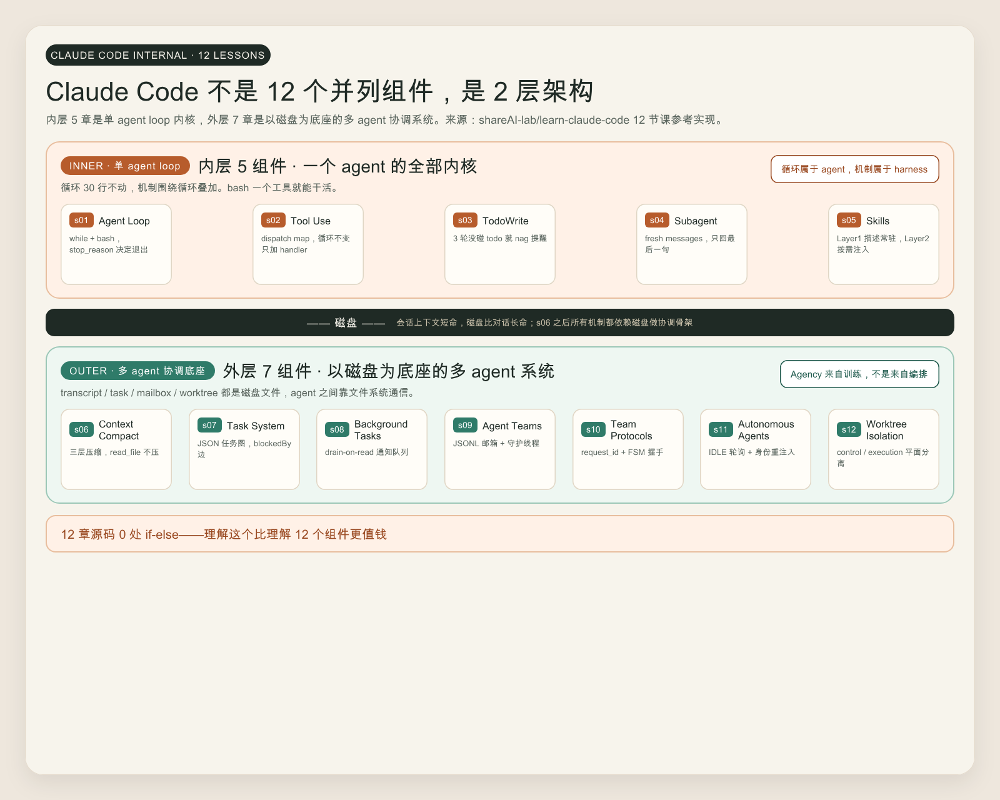

# Claude Code 内部 12 组件 — 造车人视角

你天天用 Claude Code，可能从来没想过它内部到底有几个组件。

GitHub 上 shareAI-lab 的 `learn-claude-code` 把这件事掰得很清楚——12 节课，12 个递进的机制，每章在前一章基础上叠加一个东西。我读完 12 章源码（每章 100-800 行 Python，加起来 4000 多行），读完反而发现，外界普遍流传的那张"12 组件平铺图"是错的。

这 12 章天然分两段——前 5 章是一个 agent 的内核，后 7 章是用磁盘搭起来的多 agent 协调系统。中间那条分界线，比这 12 个组件本身都重要。

光听抽象架构没意义，得看到代码长什么样才算数。

## 误读 1，12 个组件不是并列的，是 2 层架构

很多解读文章把 12 章列成一张表，循环 / 工具 / Todo / Subagent / Skill / Compact / Task / Background / Teams / Protocols / Autonomous / Worktree。然后总结一句"每章一个机制，组合起来就是 Claude Code"。

读完代码我的结论不一样——**前 5 章和后 7 章是两个不同物种**。

前 5 章（s01-s05）讲的是单个 agent 跑起来需要什么。一个 while 循环、一组工具、一份 todo、一个能 spawn 子任务的能力、一套按需加载的知识。这五样东西凑齐，你就有了一个能干活的 agent，不需要任何额外基建。

后 7 章（s06-s12）讲的完全是另一件事——一群 agent 怎么协调，怎么跨会话存活，怎么自己找活干，怎么互不打架。这些机制全部建在磁盘文件之上，跟"agent 自己能不能跑"无关。



这张分层图比一张 12 宫格平铺图准确得多。如果你在自己项目里照搬 Claude Code 的设计，搞清楚自己想抄的是内层还是外层，是不一样的两件事。

## 内层 5 组件，循环不动，只往工具箱加东西

s01 的核心代码不到 30 行。

```python
def agent_loop(messages: list):
    while True:
        response = client.messages.create(
            model=MODEL, system=SYSTEM, messages=messages,
            tools=TOOLS, max_tokens=8000,
        )
        messages.append({"role": "assistant", "content": response.content})
        if response.stop_reason != "tool_use":
            return
        results = []
        for block in response.content:
            if block.type == "tool_use":
                output = run_bash(block.input["command"])
                results.append({"type": "tool_result", "tool_use_id": block.id,
                                "content": output})
        messages.append({"role": "user", "content": results})
```

这就是 Claude Code 内核的全部。一个 while，一次模型调用，一轮工具执行，循环。退出条件**只**是 `stop_reason != "tool_use"`，没有任何外部规划逻辑——什么时候停，模型说了算。

后续 11 章里，**这个循环一行没改**。s02 加工具，循环不动，只把 `run_bash` 换成一个 dispatch 字典。

```python
TOOL_HANDLERS = {
    "bash":       lambda **kw: run_bash(kw["command"]),
    "read_file":  lambda **kw: run_read(kw["path"], kw.get("limit")),
    "write_file": lambda **kw: run_write(kw["path"], kw["content"]),
    "edit_file":  lambda **kw: run_edit(kw["path"], kw["old_text"], kw["new_text"]),
}

handler = TOOL_HANDLERS.get(block.name)
output = handler(**block.input) if handler else f"Unknown tool: {block.name}"
```

作者直接在文件 docstring 里写了一句话——"The loop didn't change at all. I just added tools." 这一句是整个仓库最关键的设计原则。内核只有一个，能力靠工具堆。

s03 的 TodoWrite 也一样。循环不变，只在循环外加了一个计数器，3 轮没碰 todo 就往工具结果里塞一句 `<reminder>Update your todos.</reminder>`。s04 的 subagent 是另一个完全独立的循环实例，父循环只通过返回值跟子循环交互。s05 的 Skill 加载更精彩，下一节单独讲。

内层 5 个组件有一个共同特征——**它们都在"一个 agent 的认知半径"内解决问题**。没人需要跨会话、没人需要跨进程、没人需要持久化。

## 关键设计，SKILL.md 的两层加载

s05 的 Skill 机制是整个仓库里最值得抄的一段代码。它解决了一个所有 agent 都会撞上的问题——知识太多，全塞 system prompt 会把 token 烧光，但模型又得知道有哪些知识可用。

`learn-claude-code` 给的方案是分两层。

```python
class SkillLoader:
    def get_descriptions(self) -> str:  # Layer 1: 短描述进 system prompt
        lines = []
        for name, skill in self.skills.items():
            desc = skill["meta"].get("description", "No description")
            lines.append(f"  - {name}: {desc}")
        return "\n".join(lines)

    def get_content(self, name: str) -> str:  # Layer 2: 完整 body 进 tool_result
        skill = self.skills.get(name)
        return f"<skill name=\"{name}\">\n{skill['body']}\n</skill>"
```

启动时 Layer 1 只把每个 skill 的名字加一句描述塞 system prompt，单 skill 大概 100 token。模型在循环里看到任务，自己判断该不该 `load_skill("pdf")`，调了才把完整 SKILL.md 正文塞进 tool_result。

这套 Layer 1 / Layer 2 模式后面还会出现两次（s06 transcript 摘要 + 全量、s09 inbox 通知 + 完整消息）。可以直接抄到自己项目，所有"元数据 cheap、详情 expensive"的资源都按这个套路注入。

SKILL.md 的 frontmatter 写法也有讲究。description 字段必须写"什么时候用我"，看仓库里 `skills/pdf/SKILL.md` 的写法。

```markdown
---
name: pdf
description: Process PDF files - extract text, create PDFs, merge documents.
  Use when user asks to read PDF, create PDF, or work with PDF files.
---
```

那个 "Use when user asks to..." 不是装饰，是给模型的判断依据。如果你的 SKILL.md description 只写 "PDF 处理工具"，模型很可能在该用的时候不调它。

## 外层 7 组件，磁盘才是真正的协调骨架

s06 之后画风一变。每一章都开始写文件、读文件、用文件做协调。

- s06 — `.transcripts/transcript_*.jsonl` 存压缩前的全量对话
- s07 — `.tasks/task_*.json` 任务依赖图
- s08 — 内存通知队列（这章是过渡）
- s09 — `.team/inbox/*.jsonl` 队友邮箱
- s10 — request_id 加 FSM 跟踪请求状态
- s11 — 扫任务板自己认领
- s12 — `.worktrees/index.json` 加 `events.jsonl` 工作树注册表

为什么后半段全是磁盘。读 s07 的 docstring 我才反应过来——**会话上下文随时会被 context compact 抹掉，跨会话/跨 agent 的协调必须落到比对话长命的存储**。

这条判断在源码里反复出现。s07 的 TaskManager 故意没用内存对象，理由是 s06 一跑内存清单就没了，磁盘任务图能跨会话存活——"任务图比任何一次对话都长命"。s11 的身份重注入更直白。

```python
# 上下文短到 ≤3 条说明刚被压缩过
if len(messages) <= 3:
    messages.insert(0, {"role": "user",
        "content": f"<identity>You are '{name}', role: {role}, "
                   f"team: {team_name}. Continue your work.</identity>"})
    messages.insert(1, {"role": "assistant",
        "content": f"I am {name}. Continuing."})
```

这 5 行代码做的事——检测到 messages 长度突然变短（说明刚被 s06 的 auto_compact 压扁了），就重新注入身份块告诉 agent "你叫什么、你属于哪个团队、继续干你的活"。这是把两个独立机制（压缩和身份）正交组合的范例。压缩负责省 token，身份负责续命，互不干扰。

会话短命，磁盘长命。这是 Claude Code 的真实底层结构，跟"循环加工具"那一层完全独立。

## 内层 vs 外层 对照

把两层的差异列出来比单看每章清楚。

| 维度 | 内层 5 组件（s01-s05） | 外层 7 组件（s06-s12） |
|---|---|---|
| 解决问题 | 一个 agent 怎么跑 | 多个 agent 怎么协调加怎么续命 |
| 状态存哪 | 内存 messages 数组 | 磁盘 .tasks / .team / .worktrees |
| 时间尺度 | 单次会话 | 跨会话、跨进程 |
| 通信方式 | 函数调用 / tool_use | JSONL 文件加 drain-on-read |
| 失败影响 | 当次任务失败 | 协调链路断裂、agent 互相不知道对方在干嘛 |
| 改动成本 | 改循环很容易（其实不用改） | 改磁盘 schema 要兼容历史文件 |
| 抄走难度 | 半天就能抄一个最小版 | 至少 1-2 周才能跑通加调稳 |

如果你做的是"领域内 single-purpose agent"（写 SQL、画 SVG、改 PR），内层 5 组件够了，外层不要碰。如果你做的是"长期常驻、多任务并行、可中断恢复"的 agent，外层那套磁盘协调骨架基本绕不开。

## 3 个反复出现的设计模式

读完 12 章我抄了 3 个模式到自己手边。

**Layer 1 / Layer 2 注入**。cheap 的元数据先塞，expensive 的内容按需拉。s05 的 Skill 是这个模式，s06 的 transcript 摘要加全量是这个模式，s09 的 inbox 通知加完整消息也是这个模式。任何"全部塞会爆 token"的资源都该这么处理，省 token 的同时让模型保留发现入口的能力。

**drain-on-read 队列**。append-only 写、每轮一次性读完清空。s09 的邮箱就 4 行核心代码。

```python
def read_inbox(self, name):
    path = self.dir / f"{name}.jsonl"
    msgs = [json.loads(l) for l in path.read_text().strip().splitlines() if l]
    path.write_text("")  # drain
    return json.dumps(msgs, indent=2)
```

并发安全（append 是原子的）、读后即清（不会重复处理）、留痕可审计（写入前都在文件里）。比任何 Redis pub/sub 都简单。如果你 agent 需要跨进程通信，先想想能不能用一个 jsonl 文件加 drain 解决，再考虑上中间件。

**状态机加 ID 关联**。每个任务、每个请求、每个工作树都有唯一 ID，状态机推进。s07 的 task 是 `pending → in_progress → completed`，s10 的请求是 `pending → approved | rejected`，s12 的 worktree 通过 task_id 双向绑定 control plane 和 execution plane。多 agent 一致性靠这个，没有 ID 全部乱套。

## Agency 来自训练，不来自编排

12 章源码里我数了一遍——**0 处用 if-else 替模型做决策**。

模型决定调什么工具，模型决定何时停，模型决定要不要 load skill，模型决定何时主动 compact，模型决定要不要认领任务。harness 写的全部是工具、记忆、边界、协调骨架，一个能让模型干活的"世界"，**没有一行代码替模型选下一步**。

作者在 README 前 30% 反复论证一件事——agent 是训练出来的，不是用 LangGraph / CrewAI 那种工作流图编出来的。代码里也是这样兑现的，12 章源码风格高度一致，没有一个分支节点、没有一个状态判断、没有一个"如果模型说 X 就做 Y"的 if 块。

这个判断比理解 12 个组件本身更值钱。它直接决定了你用哪个流派建自己的 agent。

- 信 agency 来自训练的人，工作就是给模型造工具、造记忆、造边界。harness 越薄越好。
- 如果你信 agency 来自编排，会写一堆 DSL、节点图、状态转移规则，最后变成"提示词水管工"。LangGraph、CrewAI、各种 workflow builder 是这个流派。

`learn-claude-code` 的 12 章是前一种思路的代码层证据。能看到 0 if-else 这件事本身就是论据。

## 理解了能做什么，3 件具体事

读完 12 章不是为了背诵 12 个机制名字，是为了改变你接下来 3 件事的做法。

**自建领域 agent 时，知道照搬什么、不照搬什么**。如果你要做一个"专门写 SQL 的 agent"或者"专门审 PR 的 agent"，照搬 s01-s05 就够了。一个循环、一组领域工具、一个 todo、按需 spawn 子 agent、几个 SKILL.md。s06-s12 那套磁盘协调骨架对单 agent 是过度设计，硬抄会把项目复杂度抬一倍而 0 收益。如果你要做一个"长期常驻、多人共用、能跨会话恢复"的 agent，再上 s06 加 s07 加 s11 的组合（压缩、任务图、自治轮询），其他的可以再观望。

**调试 Claude Code 异常时，知道往哪看**。Claude Code 偶尔会出现"莫名其妙忘了在干嘛"、"上下文突然清空"、"重启后丢任务"这类问题。读完外层 7 组件，能立刻定位是哪一层出问题。丢身份大概率是 s06 加 s11 那块（auto_compact 触发但身份重注入没工作），丢任务进度看 `.tasks/` 目录的 JSON 是否还在，丢通知看 `.team/inbox/` 的 jsonl 文件。Claude Code 的内部状态不是黑盒，全在 `.claude/` 之类的本地目录里，只是你之前不知道该看哪几个文件。

**评估其他 AI 编程工具时，有参照系**。Codex、Cursor、Continue、Aider 这些工具同样是某种 agent harness，但每家在内层 5 加外层 7 上的取舍不同。Cursor 重内层、几乎没有外层的多 agent 协调。Aider 内层做得很彻底、外层用 git 自带的能力（commit / branch / diff）替代了自建任务图。Codex CLI 的设计跟 Claude Code 高度同构（也有 SKILL 类机制加 AGENTS.md）但磁盘协调更轻。有了 12 章这把对照，看每家"哪些有、哪些没有、没有意味着什么"清晰得多。

## 工具壳易迭代，架构判断会沉淀

Claude Code 这个产品本身可能两年后就被新东西覆盖。但下面几个判断会留下来。

- 循环属于 agent，机制属于 harness——内核要薄，能力要靠工具堆
- 会话短命，磁盘长命——跨会话协调必须有比对话长命的存储
- Agency 来自训练，不来自编排——别用 if-else 替模型做决策
- Layer 1 / 2、drain-on-read、状态机加 ID——这 3 个模式用 5 年没问题

shareAI-lab 还有个姊妹项目叫 `claw0`，在 12 课基础上加了心跳加定时任务，做常驻 agent。如果你对"agent 从用完即走变成长期住下来"这个方向感兴趣，那是下一个值得读的仓库。

读完 12 章留下来的一句心法是，当 agent 需要"长出新行为"时，先问自己——这是该加一个工具，还是该改一层协调骨架。十次有九次，答案是前者。
