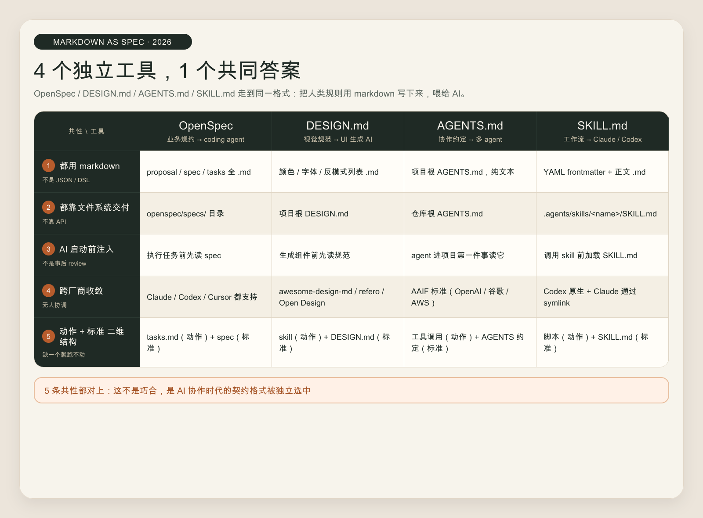

# 4 个独立工具，1 个共同答案——markdown 正在成为 AI 时代的协作契约

## 开篇

过去一年里我陆陆续续装了几样工具，OpenSpec 用来写业务规约，DESIGN.md 用来给 UI 生成 AI 喂视觉规范，AGENTS.md 用来跨工具对齐 agent 行为，SKILL.md 用来沉淀工作流。

四个工具来自四个社区，发布时间错开半年到一年，没有任何协调。装到第三个的时候我才反应过来——它们都是 markdown 文件，都放在仓库里某个固定路径，都是先写规则、再让 AI 读。

巧合到这种程度，背后多半不是巧合。这篇想把这四条线索放到一起看，给个共性 pattern，再说说为什么这件事跟你有关——不管你是 AI 编程开发者、独立开发者，还是写公众号的内容人。

## 4 个工具，4 条独立路线

先把 4 个工具一字排开，看它们各自在解决什么。

| 工具 | 写什么 | 喂给谁 | 文件落在哪 |
|---|---|---|---|
| **OpenSpec** | 业务行为规约 | coding agent | `openspec/specs/*.md` |
| **DESIGN.md** | 视觉规范（颜色、字体、间距、组件、反模式） | UI 生成 AI | 项目根 `DESIGN.md` |
| **AGENTS.md** | 跨厂商协作约定 | 进入项目的任何 agent | 仓库根 `AGENTS.md` |
| **SKILL.md** | 工作流（做什么 + 怎么做） | Claude Code / Codex / OpenCode | `.agents/skills/<name>/SKILL.md` |

四套工具背后是四个社区——OpenSpec 来自 Cursor 周边的 spec-driven 圈子；DESIGN.md 起源于一批 UI 生成项目（awesome-design-md、refero、Open Design）的不约而同；AGENTS.md 由 OpenAI 牵头，2025-12 已经进 Linux Foundation 旗下的 Agentic AI Foundation；SKILL.md 出自 Claude Code 的 harness engineering 实践，后来被 Codex / OpenCode 接住。

四件事独立发生。但它们的形态高度一致。

## 5 条共性 pattern

把它们放在 4 列 × 5 行的矩阵里看，共性立刻浮上来。



### 1. 都是 markdown，不是 JSON、不是 DSL

人类要写、AI 要读、git 要 diff、code review 要看得懂——只有 markdown 同时满足这四件事。

JSON 难写、对人不友好、注释都没法加。DSL 学习成本高，而且每个工具自造一套，迁移就完蛋。纯文本没有结构，AI 抓不到层级。markdown 站在中间——有结构（标题、列表、表格、代码块），又是纯文本，谁都能读。

### 2. 都靠文件系统交付，不靠 API

OpenSpec 把 spec 落 `openspec/specs/`，DESIGN.md 直接放项目根，AGENTS.md 也放仓库根，SKILL.md 落 `.agents/skills/<name>/`。

没人走 API，原因很现实——文件能被任何工具读，API 一旦定下来就绑死生态。仓库里放一份 markdown，今天 Claude Code 能读，明天 Codex 能读，后年新出的某个 agent 框架也能读。要是改成"调我们的 API"，三个月后这家公司方向一改，你的 spec 就废了。

### 3. 都把人类规则前置到 AI 启动之前

不是 AI 跑出来再人工 review，而是 AI 启动前就把约束注入。

prompt 是临时的、对话级的，关掉窗口就没了。markdown 契约是持久的、仓库级的，下一个进来的 agent 自动读到。这是 prompt-only 范式跟 spec-as-contract 范式的根本差别——前者像每次都重新教一遍，后者像把规矩写在墙上。

### 4. 都在跨厂商收敛

AGENTS.md 已经成了 AAIF 的正式标准，OpenAI、Anthropic、Google、Microsoft、AWS 五家都参与。SKILL.md 在 Codex 和 OpenCode 那边是原生支持，Claude Code 通过 symlink 接入。DESIGN.md 至少有 awesome-design-md、refero、Open Design 三家在用同一格式。OpenSpec 也跨 Claude Code / Codex / Cursor 共享。

跨厂商不是协调出来的，是同一个答案被不同厂商独立选中。这种"独立收敛"通常意味着背后有真实的需求结构——同一个问题，不同人独立想，想到了同一个答案。

### 5. 都是"动作 + 标准"的二维结构

最早把这件事讲明白的是 Open Design——19 个 skill（动作）+ 71 套 DESIGN.md（标准）。

回头一看，几乎所有同类项目都符合这个结构。

| 项目 | 动作（怎么做） | 标准（按什么做） |
|---|---|---|
| Open Design | 19 个 skill | 71 套 DESIGN.md |
| Superpowers | 14 个 skill | spec / test 工件 |
| OpenSpec | tasks.md 步骤 | spec / scenario |
| 本仓库 | 10 个 `.agents/skills/` | AGENTS.md / CLAUDE.md / 99_System |

单独有 skill，agent 不知道按什么标准做；单独有标准，agent 不知道怎么做。两件事拼起来才是完整工作流。

## 3 条值得记的推论

### 推论 1：未来还会出现更多 `*.md` 契约

按这个 pattern 推下去，几个可预期的候选——

- **PROMPT.md**：项目级 prompt 规约，规定 agent 怎么跟用户对话
- **VOICE.md**：品牌语气规范，给写文案的 AI 用
- **SECURITY.md**：威胁模型 + 边界，agent 应该警惕什么（可能跟现有 `.well-known/security.txt` 整合）
- **DATA.md**：数据 schema + 隐私边界

不是预言哪一个一定出现。是这个模板已经成熟，会被复制到其他领域。看到下一个新工具，先猜它是不是某种 `.md`。

### 推论 2：人类的"专业知识"正在被 markdown 化

设计师的视觉判断 → DESIGN.md。架构师的业务规约 → OpenSpec。工程师的协作约定 → AGENTS.md。Senior 的工作流经验 → SKILL.md。

以前这些东西散落在脑子里、Notion 里、Confluence 里、内部 wiki 里。现在直接以"AI 可消费"为目标书写。这是知识沉淀模式的一次转折——你写文档不再是给三个月后的自己看，是给明天进来的某个 agent 看。

对独立开发者和内容人有个直接推论——**你的私人方法论值得 markdown 化**。手里那些"我习惯这样做"，写成一份 README 或 PROCESS.md，今天能让 Claude 帮你跑得更准，明年可能就是别人 fork 你仓库时第一眼看到的东西。

### 推论 3：你正在用的仓库可能就是这个 pattern 的实例

我维护这个仓库写到一半才意识到，它本身就在走 markdown-as-spec。

- `06_Maps/taxonomy.md` 是 wiki 分类规约
- `99_System/llm-wiki约定.md` 是 wiki 操作约定
- `.agents/skills/<name>/SKILL.md` 是 10 个工作流
- `AGENTS.md` / `CLAUDE.md` / `GEMINI.md` 是跨工具协作约定
- `wiki/topics/<slug>.md` 是知识 topic 契约

meta 层和 pattern 自洽。如果你也维护着一个稍微规整的项目，回头数数仓库里有几份 `*.md` 契约，多半已经超过你以为的数量。

## 反例与待证伪

不是所有规则都能塞进 markdown。复杂状态机、严格 schema、跨语言一致性这些场景，markdown 表达力不够。可预期会出现"markdown 契约 + JSON schema 校验层"的组合形态。

格式发散也是一个问题。4 个工具都叫 markdown，但内部结构差很大——OpenSpec 走 proposal/design/spec/tasks 四件套；DESIGN.md 走颜色/字体/间距/组件；SKILL.md 走 YAML frontmatter + 正文。会不会出现一个"meta-spec spec"来统一这些 markdown 的内部结构？这件事我没看到，但按惯性推，迟早。

还有一个更深的问题——AI 真的"理解"这些 markdown 吗，还是只是凑巧有效？当下一代 LLM 推出，或者某个模型能力退化，markdown 契约的稳定性会不会被影响？这是个长期赌注，赌的是大模型未来 5 年继续偏好结构化纯文本。

## 一个示例：把这个 pattern 用在自己项目上

举个最小可执行的例子，假设你在维护一个个人博客仓库。

```
my-blog/
├── AGENTS.md           # 协作约定：测试命令、目录边界、风格偏好
├── VOICE.md            # 品牌语气：用什么人称、避免什么词
├── content/
│   └── *.md            # 文章本身
└── .agents/skills/
    └── new-post/
        └── SKILL.md    # 写新文章的工作流
```

四份 `*.md`，覆盖了 协作约定 / 内容标准 / 工作流 三层。任何一个 AI 工具进来——Claude Code、Codex、Cursor、未来某个新框架——都能直接对齐。你不用为每个工具重新教一遍。

成本是写四份 markdown，收益是后面每次跟 AI 协作都少 reload 一次上下文。

## 收尾

如果你只能从这篇带走一个判断，那就是这一句——**写给 AI 看的 markdown 契约，正在变成跟代码同等重要的工程产物**。十年前我们学会写 README，五年前我们学会写 CONTRIBUTING.md，现在轮到 AGENTS.md / SKILL.md / DESIGN.md 这一波。

工具会迭代，pattern 会留下来。下次你要新接一个 AI 工具，先问一句——它的契约文件叫什么名字、放在哪、长什么样。如果它给你的答案是某种 `.md`，恭喜，你已经熟练了。
